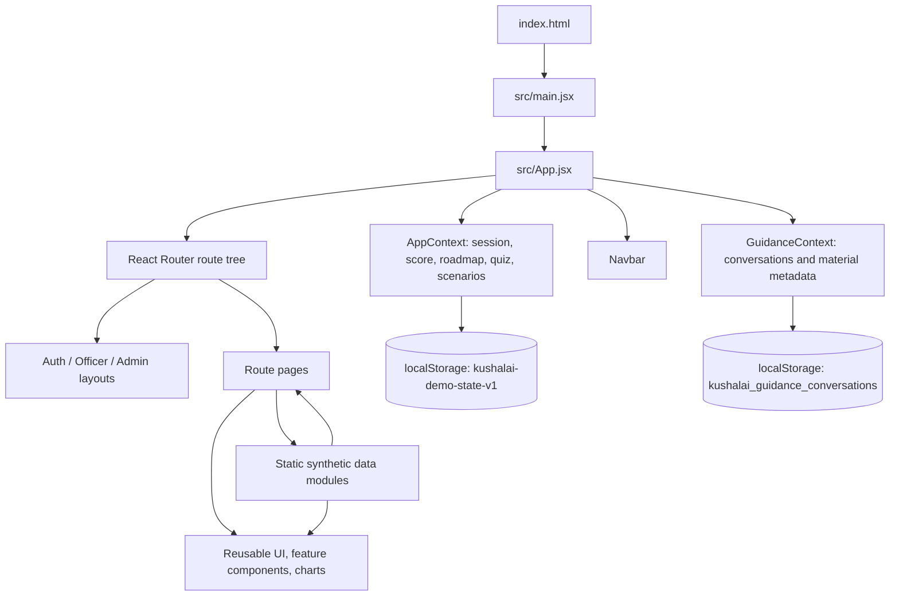
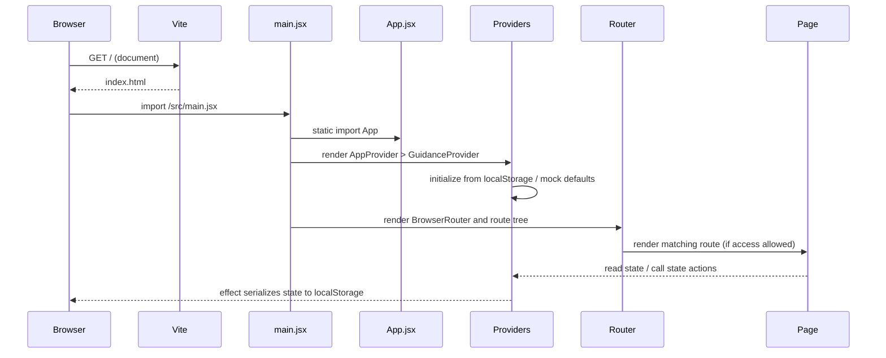
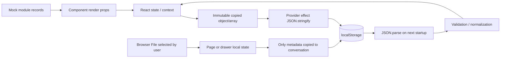
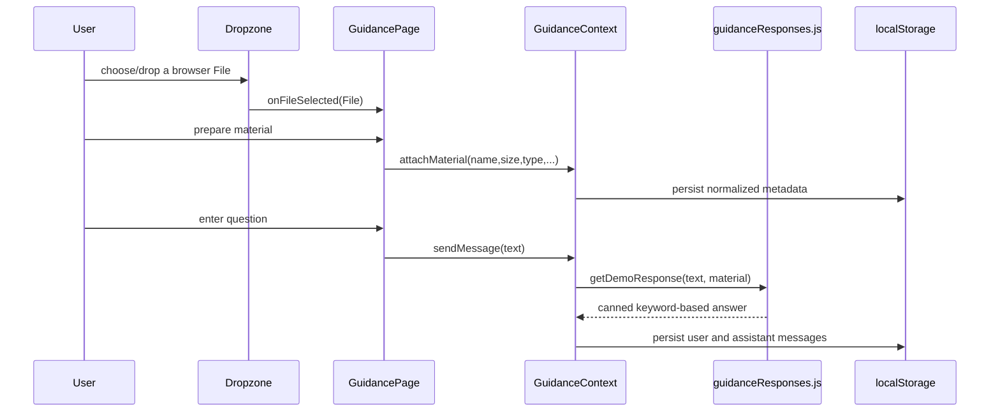

# KushalAI Codebase Understanding

This guide is derived from the files in this repository, not from an assumed product design. It explains the checked-in implementation as it exists now. The frontend README and this guide may differ where routes or behavior have changed; source code is authoritative for runtime behavior.

## 1. What This Repository Is

KushalAI is a Vite-hosted React single-page application. It is a front-end prototype, not a full-stack system: there is no backend source, database, API client, server authentication, document parser, or live integration with iGOT Karmayogi / NSSTA. User accounts, courses, assessments, analytics, and officers are synthetic data. Mutable demo state lives in React context and browser `localStorage`.

The browser therefore performs all of the important work: it resolves the URL, chooses and renders a route, mutates context state, computes derived views, and writes JSON to local storage. `npm run build` bundles the client; it does not build a server.

### Architecture at a glance



The app has no custom classes. Its reusable “objects” are plain JavaScript objects (course, officer, node, message, and attempt records), React elements/components, and browser objects such as `File`, `Date`, `Set`, refs, and local-storage strings.

## 2. Startup and Import Execution

1. Vite serves [kushalai-frontend/index.html](kushalai-frontend/index.html). The document creates `#root`, declares the browser title/favicon, loads Google Fonts, and points a module script at `/src/main.jsx`.
2. The browser evaluates [kushalai-frontend/src/main.jsx](kushalai-frontend/src/main.jsx). Its static imports are evaluated before its body: React, `react-dom/client`, `App.jsx`, and the two global stylesheets. It finds `#root`, creates a React root with `createRoot`, and renders `<App />` inside `<React.StrictMode>`.
3. Import evaluation proceeds through [kushalai-frontend/src/App.jsx](kushalai-frontend/src/App.jsx) and its static imports. `App` statically imports all pages, layouts, the navbar, and both providers. Consequently the modules are fetched/evaluated at startup, even though a page component only renders when its route matches. There is no `React.lazy` route splitting.
4. Rendering `App` creates `AppProvider`, then `GuidanceProvider`, then `BrowserRouter`. The providers run their lazy state initializers: `createInitialState()` reads and validates app state from local storage, while `loadStore()` reads and validates guidance conversations. Their effects save later state changes back to storage.
5. `AppRoutes` renders the globally shared `Navbar` and the `Routes` tree. React Router reads the current browser URL and chooses a route element. Guarded routes execute `RequireRole`; layouts render their nested `Outlet`.
6. The selected page renders, reads provider values and static data, creates its local state, and schedules effects/timers. Child components receive values and callbacks through props. State updates trigger React renders; they do not reload the document.



Importing a data module evaluates its top-level constants immediately. For example, `officers` in `mockAdmin.js` is generated once from fixed arrays when the module loads. Rendering a page repeatedly does not regenerate that module-level roster.

## 3. Route and Access Model

`AppRoutes` in `src/App.jsx` declares:

| URL | Page / layout | Gate |
|---|---|---|
| `/` | `Landing` | Public |
| `/login`, `/register`, `/profile-setup` | `AuthLayout` outlet | Public |
| `/dashboard`, `/roadmap`, `/learning-workspace`, `/doubts-guidance`, `/scenario-assessment`, `/profile` | `OfficerLayout` outlet | user exists and role is `officer` |
| `/quiz/:id` | Full-page `Quiz` | user exists and role is `officer` |
| `/admin`, `/admin/colleagues/:id` | `AdminLayout` outlet | user exists and role is `admin` |
| `/404`, any unmatched path | `NotFound` | Public |

`RequireRole({ role, children })` gets `user` from `useApp()`. No user means redirect to `/login`; a wrong role redirects admins to `/admin` and everyone else to `/dashboard`; a matching role receives the child element. This is UI routing only, not a security boundary: there is no server checking these permissions.

`Navbar` is rendered outside the route layouts on every route. It deliberately hides the signed-in account and officer/admin links on `/`, `/login`, and `/register`, even if a user is already stored. Note `/profile-setup` is not in its `isAuthRoute` test, so a stored session can appear in the navbar during setup.

## 4. Shared State, Persistence, and Object Lifecycles

### App state

[AppContext.jsx](kushalai-frontend/src/context/AppContext.jsx) owns the cross-route demo state. Its persistence key is `kushalai-demo-state-v1`.

| State | Initial source | Main updates | Consumers |
|---|---|---|---|
| `user` | persisted record or `null` | `loginAsDemo`, `logout` | route guard, navbar, dashboard/profile/passport |
| `disciplineScore`, `disciplineLog` | persisted values or demo baseline | daily officer login `+1`, first scenario submit `+5`, first node completion `+10`, inactivity penalty `-1` per eligible week | dashboard, profile |
| `roadmap` | persisted nodes or `mockRoadmap.roadmapNodes` | `completeNode` copies nodes, marks completion, unlocks dependents | roadmap, quiz, dashboard, scenario selector |
| `quizHistory` | persisted or `mockQuizzes.quizTrendHistory` | `recordQuizResult` appends score and keeps recent history | dashboard chart and latest-score KPI |
| `completedScenarioAssessments`, `scenarioAssessmentAttempts` | persisted only when the relevant array has at least 3 entries; otherwise demo attempts | `recordScenarioAssessment` | scenario result and dashboard analytics |
| `courseCompletion` | persisted or `{ completed: 9, inProgress: 3, recommended: 4 }` | `completeNode` increases completed, decreases in-progress | dashboard/profile |
| `toast` | `null` | `showToast`, `clearToast` | `ToastHost` in officer/admin layout |

`createInitialState()` tolerates invalid JSON/storage reads and validates persisted date fields. It computes missed weekly login penalties against `lastLoginDate` and tracks the latest penalty date so the same elapsed weeks are not charged repeatedly. Login dates are calendar dates; activity timestamps are ISO strings. `AppProvider` turns each state field into React state. It also keeps refs for the last login date and sets of already completed nodes/scenario courses to make one-time effects resilient to repeated event calls before a render commits.

Every provider render exposes a memoized `value` object. Pages call `useApp()` to receive that object; components call its methods to request changes. React state setters use immutable array/object copies in the main update paths. An effect serializes the selected app-state fields as JSON. Data remains on this browser profile and is not shared across devices.

### Guidance state

[GuidanceContext.jsx](kushalai-frontend/src/context/GuidanceContext.jsx) owns conversations under `kushalai_guidance_conversations`. A stored conversation is normalized to `{ id, title, createdAt, updatedAt, material, messages }`. A material record retains only file name, size, type, optional course id/title, and upload time. A message is `{ id, role, content, timestamp }`.

`createId()` uses `crypto.randomUUID()` when available and falls back to timestamp plus random text. `loadStore()` parses and filters persisted conversations/messages, chooses the stored valid selection or first conversation, and falls back to an empty store on malformed data. `storeRef` is updated immediately in `updateStore()` so consecutive actions can see the latest store without waiting for React's render. `sendMessage()` asks `getDemoResponse()` for a local answer, then appends both a user and assistant message. The provider persists the store in an effect and intentionally catches storage write failures to keep the workspace usable.

### File and object lifecycle



The `File` object itself is not uploaded, parsed, or persisted. The upload control holds it temporarily in the page/drawer. The simulated “processing” timer eventually copies selected metadata to a conversation. No real file bytes or extracted text leave the browser. React component state and JSX objects are discarded/recreated as components rerender or unmount; context state persists until logout (which only clears `user`) or the browser storage is cleared.

## 5. Major Workflows, End to End

### Login and registration

**Demo login call path:** `Login.handleDemo(role)` -> `AppContext.loginAsDemo(role)` -> set demo user and, for an officer, award one daily `+1` if the current calendar day differs from the saved login day -> show toast -> `navigate('/dashboard' or '/admin')` -> `RequireRole` admits matching role -> layout/page render. Submitting the form calls `loginAsDemo('officer')` regardless of entered credentials. The email, password, and remember checkbox are local form state only; no credential validation or persistent remember preference exists.

**Registration call path:** `Register.update(field, value)` updates the local select-form object; submit prevents browser navigation and routes to `/profile-setup`. Text fields are uncontrolled. The entered registration data is not passed to setup or stored. `ProfileSetup` starts a 900ms interval that advances its four synthetic status lines, then starts a 900ms timeout, calls `loginAsDemo('officer')`, and navigates to `/dashboard`. These screens simulate onboarding but do not create an account or analyze a profile.

### Officer dashboard

`Dashboard` waits 1.3 seconds to show a skeleton, then renders values from `useApp`, static skill domains, and `generateActivityHeatmap(14)`. It computes the active gap count from skill mastery `<55`, and course completion percentage from the stored counts. A requestAnimationFrame loop animates that percentage; cleanup cancels its last frame. The activity log deduplicates daily-login entries by date and shows five records. The course dropdown is positioned using `getBoundingClientRect`; it uses `createPortal` into `document.body` so it can escape clipping, supports outside-click/Escape and arrow-key movement, and selects “All” or an in-progress/recommended course. `SkillPassport embedded`, `ActivityHeatmap`, `QuizTrendChart`, and `ScenarioAssessmentAnalytics` receive the relevant current or static data via props.

Dashboard charts are computed from state, but mastery and activity heatmap values are mock/static: completing a quiz updates the quiz trend, roadmap status, discipline and course counts, not `skillDomains` or each `course.currentMastery`.

### Roadmap, course detail, quiz

```mermaid
sequenceDiagram
  participant User
  participant RoadmapPage
  participant Roadmap
  participant Drawer as CourseDrawer
  participant Quiz
  participant AppState as AppContext
  User->>RoadmapPage: choose filters / click a node
  RoadmapPage->>Roadmap: pass filtered nodes and click callback
  Roadmap-->>RoadmapPage: selected node
  RoadmapPage->>Drawer: node + catalog course + prerequisite titles
  User->>Drawer: Start quiz
  Drawer->>Quiz: navigate /quiz/:courseId
  Quiz->>Quiz: load static quiz + course by route id
  User->>Quiz: choose one option per question, submit
  Quiz->>AppState: recordQuizResult(course title, percent)
  Quiz->>AppState: completeNode(node id), if not already completed
  AppState->>AppState: mark node, unlock dependents, +10 discipline once
  AppState-->>Quiz: updated context; render results
```

`RoadmapPage` filters context nodes by domain/status. `Roadmap` derives prerequisite connectors with `connectorsForNodes`, joins each node to a course with `getCourseById`, and renders desktop canvas or mobile sorted list. Clicking any node opens the drawer; locked nodes can be inspected, but the course/quiz actions are disabled. `prereqTitlesFor()` joins prerequisite node IDs back to catalog course titles.

`Quiz` reads `:id` as the **course ID**, not the quiz object's own `q-*` ID. It loads the course and quiz, stores answer indices in a local object keyed by question ID, locks an answered question, requires each question before advancing, and shows `QuizResult` after submit. It computes percentage from correct choices and calls `recordQuizResult`. If the course has a roadmap node not already completed, it also calls `completeNode`; that action marks it complete, unlocks locked nodes whose prerequisite IDs are now all complete, adds discipline points, logs activity, and updates course counts. Re-taking a completed quiz records another quiz attempt but does not award completion points again. A course/quiz missing from the mock lookup produces an empty state.

The catalog's mastery percentages are not updated by this flow; the displayed result's “+ mastery” is descriptive UI, not an actual mastery mutation.

### Course material to guidance

There are two entry points to the same metadata-only behavior:

1. The course drawer's `UploadDropzone` stores a browser `File` in drawer state. `prepareGuidanceWorkspace()` advances four 600ms phases, then calls `createConversation({ material: metadata })` and navigates to `/doubts-guidance`.
2. On `/doubts-guidance`, the page stores a selected file locally. `prepareMaterial()` ensures a current conversation, runs the same timed progress, and calls `attachMaterial(metadata, conversationId)`. It then resets local upload state.

In both cases `GuidanceProvider` normalizes and persists metadata only. `DoubtsGuidance` groups threads into Today/Yesterday/Older; `GuidanceChat` sends text through `sendMessage`; the provider obtains a deterministic keyword-matched reply from `getDemoResponse` and appends two message objects. Rename/delete/select/new-thread operations mutate the provider's conversation list. Practice MCQ is independent local component state. The only filename with a fixed sample summary is `AI_ML_Study_Notes_Synthetic.pdf`; arbitrary uploaded material is never read, despite the simulated “Reading document” labels.



### Scenario assessment

`ScenarioAssessment` creates a course list by joining every context roadmap node to `mockCourses`. Selecting a course chooses its assessment blueprint from `scenarioAssessments`; intro -> questions -> result are three render states of the same page. Question index and answer object are local state. Four MCQs are automatically scored; three short and three long responses are accepted as text and only counted as submitted, not graded. `recordScenarioAssessment(courseId, title, correctCount, mcqTotal)` appends an attempt every submit; a `Set` ensures the first completion for a course alone awards `+5` and logs it. Written text is not passed to the context and is not saved. Attempts and completion course IDs persist. Returning from result navigates to Learning Workspace.

### Admin analytics and detail

`mockAdmin.js` builds a deterministic synthetic 12-person roster at import time, deriving per-skill scores from indices and assigning top gaps/status. `AdminDashboard` uses `useMemo` to filter it by case-insensitive name, department, and status; KPI values and emerging gap counts are derived from the roster. `Heatmap`, `EmergingSkills`, and `ColleagueTable` are presentational children. Clicking a roster row navigates with its synthetic ID. `AdminColleagueDetail` reads `:id`, calls `getOfficerById`, and either shows an empty state or renders that person's metrics, skill values, gaps, qualifications, and recent activity. Admin screens do not mutate provider state.

## 6. Function Reference and File-by-File Inventory

In the entries below, “inputs/outputs” means data passed through the module or function, not network traffic. Static imports are listed as dependencies; `imported by` names local consumers. React component functions return React element trees; event callbacks usually return nothing. Inline JSX callbacks are described by their event and effect instead of listing each trivial closure separately. There are no project-defined classes or constructors.

### Repository root

| File | Purpose, location, execution, and communication |
|---|---|
| [README.md](README.md) | Root-level title only (`# KushalAI`). It is documentation, never imported/executed. It gives no architecture details; the detailed frontend README is below. |
| [.gitignore](.gitignore) | Git exclusion rules for dependencies/build output, env files, package-manager logs, and OS metadata. Git consults it; the browser and Vite do not import it. `.env.example` is explicitly not ignored. |
| [understanding.md](understanding.md) | This locally derived guide. Documentation only; no runtime consumer. |

### Frontend setup and public assets

| File | Purpose, inputs/outputs, use, importers |
|---|---|
| [kushalai-frontend/index.html](kushalai-frontend/index.html) | Vite HTML entry document. Supplies metadata, title, favicon `/assets/kushalAI_logo.png`, Google Font preconnect/stylesheet links, `#root`, and `/src/main.jsx`. Vite serves/transforms it; it is not imported by a JS module. |
| [kushalai-frontend/package.json](kushalai-frontend/package.json) | npm manifest. Scripts: `dev` (Vite), `build` (Vite production bundle), `preview` (serve built output). Runtime dependencies are React, React DOM, React Router, lucide-react, Recharts, and Framer Motion; Vite/plugin-react are dev dependencies. It has no application functions. The lockfile and npm consume it. `framer-motion` is currently unused by source imports. |
| [kushalai-frontend/package-lock.json](kushalai-frontend/package-lock.json) | npm-generated exact dependency-resolution lock. It is read by `npm ci`/npm installation, not imported or run by the app; it pins the package tree beyond the version ranges in `package.json`. Do not edit it manually. |
| [kushalai-frontend/requirements.txt](kushalai-frontend/requirements.txt) | Text setup notes that list Node/npm and npm packages/commands despite the `.txt` name. No Python package or backend is present; Python never executes this file. It is not imported. |
| [kushalai-frontend/README.md](kushalai-frontend/README.md) | Setup, demo login, structure, route and limitation notes. Documentation only. Its route table is older/incomplete relative to `App.jsx` (for example learning workspace, guidance, and scenario assessment are actual routes). Treat current source as authoritative. |
| [kushalai-frontend/vite.config.js](kushalai-frontend/vite.config.js) | Vite's Node-side config, evaluated by Vite when running/building. Imports `defineConfig` and `@vitejs/plugin-react`, enables the React plugin, chooses port 5173 and opens the browser in dev. It returns the config object; it is not browser code. |
| [kushalai-frontend/public/assets/kushalAI_logo.png](kushalai-frontend/public/assets/kushalAI_logo.png) | Static logo image served at `/assets/kushalAI_logo.png`. Used as the HTML favicon and by `Navbar`/`Profile`. Vite copies public assets without importing them into the JS module graph. |
| [kushalai-frontend/public/assets/pfp.jpg](kushalai-frontend/public/assets/pfp.jpg) | Static profile/avatar photograph served at `/assets/pfp.jpg`, used by `Navbar` and `Profile`. Same public asset lifecycle as the logo; it is not data fetched from a profile API. |

### Runtime entry, routing, and contexts

| File | Imports / imported by | Functions, behavior, and data contract |
|---|---|---|
| [kushalai-frontend/src/main.jsx](kushalai-frontend/src/main.jsx) | Imports React, `createRoot`, `App`, `globals.css`, `components.css`; entry referenced by `index.html`. | Module body runs first in the React app. Calls `createRoot(document.getElementById('root'))`, then `.render(<StrictMode><App /></StrictMode>)`. Creates the React root and element; returns no application data. Removing it leaves the HTML root blank. |
| [kushalai-frontend/src/App.jsx](kushalai-frontend/src/App.jsx) | Imports React Router; both contexts; navbar; three layouts; all page modules. Imported by `main.jsx`. | `RequireRole({role, children})` runs on guarded route render; inputs are required role and route element, reads `user` via `useApp`, returns child or `<Navigate>`. `AppRoutes()` returns navbar + routes/outlets. `App()` returns provider nesting around `BrowserRouter` and route tree. These functions compose routing and state; deleting the guard removes role-based navigation, deleting route definitions removes their URLs, and deleting `App` breaks the mounted app. All listed page module imports are static/eager. |
| [kushalai-frontend/src/context/AppContext.jsx](kushalai-frontend/src/context/AppContext.jsx) | Imports demo users, initial roadmap/history/scenario attempts; imported by `App`, `Navbar`, `ToastHost`, `CourseDrawer`, `RoadmapPage`, `Dashboard`, `Quiz`, `Profile`, `ProfileSetup`, `ScenarioAssessment`, and `SkillPassport`. | Private helpers: `loadPersisted()` reads/JSON-parses app state, returns object or null; `getCalendarDate(date)` returns local `YYYY-MM-DD`; `isCalendarDate(value)` validates the date string; `daysBetween(a,b)` and `addCalendarDays(date,n)` support inactivity accounting; `createInitialState()` merges validated persistence with mock defaults and computes missed-week penalties. `AppProvider({children})` constructs React state/ref objects, provides actions and persists a JSON payload. `showToast(message, variant='info')` stores a toast object. `loginAsDemo(role)` selects demo account, applies officer daily reward once per date, logs it and shows toast. `logout()` clears only user. `completeNode(nodeId)` guards unknown/already-completed IDs, immutably marks the node, unlocks dependents with satisfied prereqs, adds 10 discipline points/log entry, updates course counts. `recordQuizResult(courseTitle, scorePercent)` appends an attempt (course title is accepted but history stores attempt label/score). `recordScenarioAssessment(courseId, courseTitle, mcqScore, mcqTotal)` appends attempt and awards first completion only; returns reward boolean. `useApp()` returns context value or throws outside provider. The provider's `value` object exports state/actions and an inline `clearToast`. Removing helpers breaks initialization/reward/persistence; removing provider/actions disconnects dependent flows. |
| [kushalai-frontend/src/context/GuidanceContext.jsx](kushalai-frontend/src/context/GuidanceContext.jsx) | Imports `getDemoResponse`; imported by `App`, `CourseDrawer`, and `DoubtsGuidance`. | `createId()` uses UUID/fallback string. `normalizeMaterial(material)` returns sanitized metadata/null. `isValidMessage(message)` returns a shape predicate. `loadStore()` parses, filters, and normalizes saved conversations; `titleForMaterial(material)` chooses course/file/default title; `createMessage(role,content,timestamp)` returns a message object. `GuidanceProvider({children})` holds store state/ref and persistence effect. Its `updateStore(updater)` applies updater, synchronizes ref/state, and returns next store. `createConversation({title,material})` creates and prepends a timestamped conversation, selects it, returns it. `ensureConversation()` returns selected/existing/new conversation. `selectConversation(id)` changes selection if found. `attachMaterial(material,conversationId)` normalizes and copies metadata into selected thread (or creates one), returns selected ID/null. `sendMessage(content)` trims, obtains a canned answer, updates title on first user question, appends two messages; empty text is ignored. `renameConversation(id,title)` trims and updates matching record; blank ignored. `deleteConversation(id)` removes it and selects the next one if necessary. `useGuidance()` returns context or throws outside provider. These actions are the only thread mutation interface. |

### Static data and demo-domain helpers

| File | Imports / imported by | Data and functions |
|---|---|---|
| [kushalai-frontend/src/data/mockUsers.js](kushalai-frontend/src/data/mockUsers.js) | Imported by `AppContext`. | Exports plain `demoOfficer` and `demoAdmin` records (IDs, roles and profile details). `findDemoUserByRole(role)` returns admin only for `'admin'`, otherwise officer; currently no caller, since context chooses directly. No mutation/API. |
| [kushalai-frontend/src/data/mockCourses.js](kushalai-frontend/src/data/mockCourses.js) | Imported by roadmap, drawer, dashboard, quiz, scenario, analytics, and passport. | `courses` is the static catalog of 13 course objects with ID/title/domain/skill/source/difficulty/time/description/mastery/target/reason. `getCourseById(id)` finds a course, returning object or `undefined`. These objects are not changed when the learner completes work. |
| [kushalai-frontend/src/data/mockRoadmap.js](kushalai-frontend/src/data/mockRoadmap.js) | Imported by context, roadmap page and roadmap component. | `roadmapNodes` contains 13 graph-node records: ID, course ID, status, domain, prerequisite IDs, canvas x/y. `connectorsForNodes(nodes)` builds an ID lookup and returns `{from,to}` link objects for valid prerequisite references. `prereqTitlesFor(node,nodes,coursesById)` resolves prerequisite node IDs through a supplied course lookup, returning nonempty titles. Inputs are context nodes/catalog; returned links/titles are derived, not stored. |
| [kushalai-frontend/src/data/mockQuizzes.js](kushalai-frontend/src/data/mockQuizzes.js) | Imported by context, dashboard, quiz and drawer. | `quizzes` maps course IDs to fixed quiz objects/questions; each question stores prompt/options/correct index/explanation. `getQuizByCourseId(courseId)` returns quiz/null. `quizTrendHistory` is initial attempt/score data. `generateActivityHeatmap(weeks=14)` makes an array of daily `{date,level}` objects using a deterministic date-based pattern; it returns view data, not persisted activity. |
| [kushalai-frontend/src/data/mockSkills.js](kushalai-frontend/src/data/mockSkills.js) | Imported by admin data/components, dashboard, profile and passport. | `statusFromMastery(mastery)` maps thresholds 85/70/45 to Mastered/Proficient/Developing/Gap. `skillDomains` holds domains and competency records (mastery/evidence). `domainAverage(domain)` rounds mean mastery. `overallScore()` flattens and averages all competencies. `heatmapSkills` defines admin heatmap columns. All scores/evidence are fixed mock data. |
| [kushalai-frontend/src/data/mockAdmin.js](kushalai-frontend/src/data/mockAdmin.js) | Imports `heatmapSkills`; imported by admin dashboard and colleague detail. | Private arrays define departments/designations/names. `seededMastery(seed,offset)` returns deterministic bounded score. At import time `officers = names.map(...)` creates officer objects and nested `skillMastery`, derives two lowest gaps, status, activity, etc. `getOfficerById(id)` returns matching officer/undefined. `adminKpis` is precomputed at import. `emergingSkillGaps()` counts officers under mastery 55 per skill and returns descending records. `departmentDistribution` is precomputed but currently unused. |
| [kushalai-frontend/src/data/mockScenarioAssessments.js](kushalai-frontend/src/data/mockScenarioAssessments.js) | Imported by app context, scenario page and analytics. | Private `courseBlueprints` maps course IDs to title/focus and 4 MCQs, 3 short, 3 long prompts. `buildAssessment(courseId,blueprint)` converts tuples/prompts into question objects and returns `{courseId,questions}`; MCQs carry answer index and canned explanation, written prompts carry expected-point metadata. `scenarioAssessments` is built once with `Object.fromEntries`. `demoScenarioAssessmentAttempts` provides initial attempt objects. Written answer text is not included here or persisted. |

### Layouts, shared UI, and visualizations

| File | Imports / imported by | Responsibilities and callable behavior |
|---|---|---|
| [kushalai-frontend/src/layouts/AuthLayout.jsx](kushalai-frontend/src/layouts/AuthLayout.jsx) | Imports `Link`, `Outlet`; imported by `App`. | `AuthLayout()` returns auth two-panel composition and outlet for login/register/setup. Its branding SVG and embedded style are presentation only. Child route elements arrive through React Router outlet context, not function arguments. |
| [kushalai-frontend/src/layouts/OfficerLayout.jsx](kushalai-frontend/src/layouts/OfficerLayout.jsx) | Imports `Outlet`, `ToastHost`; imported by `App`. | `OfficerLayout()` wraps nested page outlet in the standard shell and mounts `ToastHost`. It does not check role; `RequireRole` is the parent gate. |
| [kushalai-frontend/src/layouts/AdminLayout.jsx](kushalai-frontend/src/layouts/AdminLayout.jsx) | Same imports as officer layout; imported by `App`. | `AdminLayout()` provides the admin shell/outlet and toast host. Access control is outside this component. |
| [kushalai-frontend/src/components/common/UI.jsx](kushalai-frontend/src/components/common/UI.jsx) | React only; imported by many pages and components. | Stateless presentation helpers: `Button({variant,size,block,children,className,...rest})` combines CSS classes and forwards native props; `Card({children,className,flush,hover,style,...rest})` wraps content; `StatusBadge({status,label})` maps known status to tone; `Badge({children,tone})`; `Pill({active,children,...rest})`; `Field({label,children,hint})`; `Input(props)`; `Select({children,...rest})`; `ProgressBar({value})` clamps visual width to 0–100; `CircularProgress({value,size,stroke,label,sublabel})` computes SVG radius/circumference/dash offset; `StatCard({icon,label,value,sub})`; `Avatar({name,size})` derives up to two initials; `Tabs({tabs,active,onChange})` emits tab buttons but currently has no consumer; `Skeleton({width,height,radius,style})`; `EmptyState({icon,title,message,action})`. Each returns JSX and forwards or derives display props; none owns domain state. Removing an export breaks its importing views. |
| [kushalai-frontend/src/components/common/Navbar.jsx](kushalai-frontend/src/components/common/Navbar.jsx) | React hooks, router links/location/navigation, lucide icons, `useApp`; imported by `App`. | `RouteLink({link,onNavigate,className,activeOverride})` translates link metadata into `NavLink` and icon. `Navbar()` reads path/user, chooses public/officer/admin links, stores open menu and header ref. Effects close menus on route changes and attach/remove outside-pointer/Escape listeners while open. `handleLogout()` closes, calls context logout, navigates login; `closeMenu()` resets menu. Inputs are route/user context; output is shared responsive header/account menu. The disabled bell is placeholder. |
| [kushalai-frontend/src/components/common/ToastHost.jsx](kushalai-frontend/src/components/common/ToastHost.jsx) | React effect and `useApp`; imported by both authenticated layouts. | `ToastHost()` reads toast and clear action; effect schedules clear in 3.2s and cancels old timer on change/unmount; returns null or toast markup. It displays provider messages; no new domain object. |
| [kushalai-frontend/src/components/common/PageHeader.jsx](kushalai-frontend/src/components/common/PageHeader.jsx) | React only; imported by admin, profile, roadmap pages. | `PageHeader({eyebrow,title,subtitle,action})` returns shared heading markup. Missing optional props simply omit those elements. |
| [kushalai-frontend/src/components/common/Drawer.jsx](kushalai-frontend/src/components/common/Drawer.jsx) | React effect, `X`; imported only by `CourseDrawer`. | `Drawer({open,onClose,title,children})` attaches Escape key handler only while open, removes it on cleanup, returns null when closed; otherwise returns overlay/dialog. It forwards children/title and never owns drawer content state. |
| [kushalai-frontend/src/components/common/Modal.jsx](kushalai-frontend/src/components/common/Modal.jsx) | React effect, `X`; no current local importer. | `Modal({open,onClose,title,children,footer})` conditionally attaches Escape handling and returns null/dialog. Clicking the backdrop closes only when the backdrop itself is the target. Presently available but unused. |
| [kushalai-frontend/src/components/dashboard/ActivityHeatmap.jsx](kushalai-frontend/src/components/dashboard/ActivityHeatmap.jsx) | React only; imported by `Dashboard`. | `ActivityHeatmap({days})` chunks daily records into weeks, derives month labels, renders day levels with title metadata and legend. It creates temporary arrays for chunks/labels, returns visual elements, and does not alter activity data. |
| [kushalai-frontend/src/components/dashboard/QuizTrendChart.jsx](kushalai-frontend/src/components/dashboard/QuizTrendChart.jsx) | React and Recharts; imported by `Dashboard`. | `QuizTrendChart({data})` reads latest/previous scores, calculates their delta, and returns a Recharts line chart. Requires nonempty data in the current caller; no data mutation. |
| [kushalai-frontend/src/components/dashboard/ScenarioAssessmentAnalytics.jsx](kushalai-frontend/src/components/dashboard/ScenarioAssessmentAnalytics.jsx) | React `useMemo`, router `Link`, Recharts, scenario data and course catalog; imported by `Dashboard`. | `formatDate(value)` formats attempt date. `ScenarioAssessmentAnalytics({completedScenarioAssessments,attempts})` counts configured/completed assessments, memoizes a sorted/filtered copied attempt list with labels and percentage, calculates average/best/latest comparison and donut segments, returns charts or empty state. Sorting is on a filtered new array, not the context array. |
| [kushalai-frontend/src/components/admin/Heatmap.jsx](kushalai-frontend/src/components/admin/Heatmap.jsx) | React state and `heatmapSkills`; imported by `AdminDashboard`. | `cellColor(value)` maps score ranges to background/text colors. `Heatmap({officers})` renders up to 12 rows, sets/clears hovered `{officer,skill,value}` state and shows detail. It only reads roster records. |
| [kushalai-frontend/src/components/admin/EmergingSkills.jsx](kushalai-frontend/src/components/admin/EmergingSkills.jsx) | React; imported by `AdminDashboard`. | `EmergingSkills({data})` calculates a nonzero maximum for relative bar widths and maps sorted gap-count records to rows. Pure display component. |
| [kushalai-frontend/src/components/admin/ColleagueTable.jsx](kushalai-frontend/src/components/admin/ColleagueTable.jsx) | React, `useNavigate`, `Avatar`/`Badge`; imported by `AdminDashboard`. | `ColleagueTable({officers})` maps roster records to rows; click navigates to `/admin/colleagues/:id`; empty input returns an empty-result row. `STATUS_TONE` maps labels to badge tones. Does not modify officers. |

### Roadmap, quiz, and guidance components

| File | Imports / imported by | Responsibilities and functions |
|---|---|---|
| [kushalai-frontend/src/components/roadmap/Roadmap.jsx](kushalai-frontend/src/components/roadmap/Roadmap.jsx) | React hooks, `RoadmapNode`, connector helper, course lookup; imported by `RoadmapPage`. | `useIsMobile()` initializes from viewport width, subscribes to resize, returns boolean, unsubscribes on unmount. `connectorColor(status)` chooses completed vs neutral line color. `Roadmap({nodes,onNodeClick})` derives links and course objects. Mobile sorts a copied node array by y/x and renders a vertical list; desktop renders SVG prerequisite curves and positioned nodes. Node click sends the original node back through the callback. |
| [kushalai-frontend/src/components/roadmap/RoadmapNode.jsx](kushalai-frontend/src/components/roadmap/RoadmapNode.jsx) | React state, lucide status icons; imported by `Roadmap`. | `RoadmapNode({node,course,onClick,style})` selects style/icon from status, stores hover boolean, returns button with node status/title and hover/current decorations. It receives but does not modify the node/course; click only delegates. |
| [kushalai-frontend/src/components/roadmap/CourseDrawer.jsx](kushalai-frontend/src/components/roadmap/CourseDrawer.jsx) | React hooks, router navigation, icons, common Drawer/UI, UploadDropzone, quiz lookup, both contexts; imported by `RoadmapPage`. | `CourseDrawer({node,course,prereqTitles,open,onClose})` derives locked state, mastery gap/progress, quiz availability. `resetUploadState()` clears interval/timeout and local upload state; `handleClose()` resets then delegates. An unmount effect clears timers. `prepareGuidanceWorkspace()` guards missing file/reentry, starts a 600ms phase interval, then calls `createConversation` with file/course metadata and navigates guidance. `goToQuiz()` closes and navigates to `/quiz/courseId`; `goToCourse()` opens the illustrative external iGOT URL safely in a new tab. Local objects: browser `File`, timer IDs, metadata object. It returns null if no node/course, otherwise Drawer with course details/actions. `MetaItem({icon,label,value})` and `Insight({label,value,accent})` are private stateless display helpers. |
| [kushalai-frontend/src/components/roadmap/UploadDropzone.jsx](kushalai-frontend/src/components/roadmap/UploadDropzone.jsx) | React ref/state and lucide icons; imported by drawer and guidance page. | `UploadDropzone({file,onFileSelected,onClear,title,description,chooseLabel})` owns only drag-active state and file-input ref. `handleFiles(fileList)` passes the first selected/dropped `File` to parent callback; no parser, MIME/size validation, or upload is performed. It returns file preview or keyboard/mouse/drop-enabled chooser. Parent owns selected File reference. |
| [kushalai-frontend/src/components/quiz/QuizProgress.jsx](kushalai-frontend/src/components/quiz/QuizProgress.jsx) | React and `ProgressBar`; imported by `Quiz`. | `QuizProgress({current,total})` computes current/total percentage for display and delegates bar rendering. |
| [kushalai-frontend/src/components/quiz/QuizQuestion.jsx](kushalai-frontend/src/components/quiz/QuizQuestion.jsx) | React and check/cross icons; imported by `Quiz`. | `QuizQuestion({question,selected,onSelect,revealed})` maps options, derives selected/correct styles, calls `onSelect(index)` before reveal, and shows the answer/explanation after reveal. It does not own answers. |
| [kushalai-frontend/src/components/quiz/QuizResult.jsx](kushalai-frontend/src/components/quiz/QuizResult.jsx) | React, icons, Card/Button; imported by `Quiz`. | Private `verdict(score)` maps thresholds to summary text. `QuizResult({quiz,answers,scorePercent,onReturnToRoadmap,onBackToDashboard})` derives correct count, renders summary and per-question review, delegates navigation callbacks. Private `Stat({label,value,tone})` maps tone to color and returns one metric. |
| [kushalai-frontend/src/components/guidance/GuidanceChat.jsx](kushalai-frontend/src/components/guidance/GuidanceChat.jsx) | React state/effects/refs and Send icon; imported by `DoubtsGuidance`. | `GuidanceChat({conversation,onSendMessage})` derives messages, keeps draft/input/end refs, scrolls to newest message and focuses input when thread changes. `sendMessage(event)` prevents submit, trims and delegates nonblank text, then clears draft. `handleInputKeyDown(event)` uses Enter without Shift to submit. Suggestions call parent directly. No answer is generated here. |
| [kushalai-frontend/src/components/guidance/PracticeQuestion.jsx](kushalai-frontend/src/components/guidance/PracticeQuestion.jsx) | React state and shared Button; imported by `DoubtsGuidance`. | Fixed `OPTIONS` and `CORRECT_OPTION` define one MCQ. `PracticeQuestion()` owns visibility and selected option. `generatePractice()` resets selection and reveals the same fixed question; choosing an option sets local state and reveals fixed feedback. No new question is generated and result is not saved. |

### Page modules

| File | Imports / imported by | Functions, state, data movement, and removal impact |
|---|---|---|
| [kushalai-frontend/src/pages/AdminDashboard.jsx](kushalai-frontend/src/pages/AdminDashboard.jsx) | React `useMemo`/`useState`, icons, shared header/UI, three admin visual components, `mockAdmin`; imported by `App`. | `DEPARTMENTS` is derived from the synthetic roster; `STATUSES` lists filter values. `AdminDashboard()` owns search/department/status filters. Its memoized predicate checks case-insensitive name substring and exact department/status, returning a filtered new roster array. `emergingSkillGaps()` supplies chart data; static KPIs, heatmap, emerging-skill bars, and filtered `ColleagueTable` are rendered. It has no mutation of roster or provider state. Removing it removes `/admin`. |
| [kushalai-frontend/src/pages/AdminColleagueDetail.jsx](kushalai-frontend/src/pages/AdminColleagueDetail.jsx) | React, router params/navigation, UI, `getOfficerById`, heatmap skill columns; imported by `App`. | `AdminColleagueDetail()` reads route `id`, looks up one synthetic officer, and returns a not-found view or the selected officer's profile, score, skill bars, gaps, qualifications, and recent activity. Back buttons navigate to `/admin`. It reads but does not modify the officer object. Removing it removes the detail route. |
| [kushalai-frontend/src/pages/Landing.jsx](kushalai-frontend/src/pages/Landing.jsx) | Router Link, icons, UI; imported by `App`. | Module constant `FEATURES` holds icon/title/text objects. `Landing()` maps them into the public landing page and returns links to registration/login. Stateless. Removing it breaks `/` route rendering. |
| [kushalai-frontend/src/pages/Login.jsx](kushalai-frontend/src/pages/Login.jsx) | React state, router, UI fields, `useApp`; imported by `App`. | `Login()` owns email/password/remember state (credential values do not validate or persist). `handleSubmit(event)` prevents default, signs in as officer, navigates dashboard. `handleDemo(role)` signs in as the requested demo role and routes by role. Removing handlers disables login actions; there is no external auth call. |
| [kushalai-frontend/src/pages/Register.jsx](kushalai-frontend/src/pages/Register.jsx) | React state, router, shared form UI; imported by `App`. | Constants `DESIGNATIONS`, `DEPARTMENTS`, `QUALIFICATIONS`, `TRAININGS`, `DOMAINS` supply select options. `Register()` owns object state for the selected fields. `update(field,value)` immutable-copies the form; `handleSubmit(event)` prevents reload and navigates to profile setup, but does not submit the form object. Name/ID/email controls are uncontrolled. |
| [kushalai-frontend/src/pages/ProfileSetup.jsx](kushalai-frontend/src/pages/ProfileSetup.jsx) | React state/effects, router, icon, `useApp`; imported by `App`. | `STEPS` is fixed simulated status copy. `ProfileSetup()` has step/done state. First effect interval advances steps at 900ms and cleans up; second effect, when done, schedules demo officer login/navigation and cancels timeout on cleanup. Does not inspect profile data. |
| [kushalai-frontend/src/pages/NotFound.jsx](kushalai-frontend/src/pages/NotFound.jsx) | Router, icon, `Button`/`EmptyState`; imported by `App`. | `NotFound()` gets `navigate`, renders a “back home” callback. No state or data. Used for `/404` and catch-all. |
| [kushalai-frontend/src/pages/LearningWorkspace.jsx](kushalai-frontend/src/pages/LearningWorkspace.jsx) | React, icons, router navigation; imported by `App`. | `MODES` holds guidance and scenario destination metadata. `LearningWorkspace()` renders the two modes; button handlers call `navigate(mode.path)`. It is a navigation hub, not an assessment engine. |
| [kushalai-frontend/src/pages/RoadmapPage.jsx](kushalai-frontend/src/pages/RoadmapPage.jsx) | React hooks, PageHeader/UI, roadmap/drawer components, `useApp`, course and prereq lookups; imported by `App`. | Constants define domain/status filters. `RoadmapLoadingSkeleton()` returns loading markup. `RoadmapPage()` owns loading, filters, selected node state; derives filtered nodes, matching course and prerequisite titles from context/catalog; one effect clears a 1s loading timer. Renders Roadmap and passes node-selection callback into CourseDrawer. Removing it disconnects roadmap browsing from state and course actions. |
| [kushalai-frontend/src/pages/Quiz.jsx](kushalai-frontend/src/pages/Quiz.jsx) | React state, router params/nav, UI, quiz children/data, `useApp`, icon; imported by `App`. | `Quiz()` uses route `id` to retrieve course and quiz, owns question index/answer map/submitted flag. `selectOption(index)` ignores already answered question and copy-updates answer map. `handleSubmit()` counts correct, computes percent, calls context record; finds roadmap node and completes if needed; sets submitted. Outputs invalid-quiz empty state, active question/progress, or result review. Removing it breaks `/quiz/:id` completion path. |
| [kushalai-frontend/src/pages/ScenarioAssessment.jsx](kushalai-frontend/src/pages/ScenarioAssessment.jsx) | React memo/state, icons/router/context, course and scenario mock data; imported by `App`. | Private `statusLabel(status)` presents current as Current focus. `CourseSelection({courses,onSelect,onBack})`, `AssessmentIntro({course,alreadyCompleted,onStart,onBack})`, `AssessmentQuestion({question,answer,onAnswer})`, and `AssessmentResult({course,correctCount,writtenCount,rewarded,onBack})` are presentational child components. `ScenarioAssessment()` derives joined courses with `useMemo`, then owns selected ID/start/index/answer/result state. `chooseCourse(id)` resets flow; `startAssessment()` resets answer/index; `setAnswer(value)` stores under current question ID; `submitAssessment()` scores MCQs, counts nonempty written answers, calls provider, stores result. Result records no written text. |
| [kushalai-frontend/src/pages/DoubtsGuidance.jsx](kushalai-frontend/src/pages/DoubtsGuidance.jsx) | React hooks, icons/router, guidance context, chat/practice/dropzone, response constants; imported by `App`. | `dateKey(value)` returns local date key or null. `getConversationGroups(conversations)` returns Today/Yesterday/Older buckets. `formatUpdatedAt(value)` returns local time/date text. `DoubtsGuidance()` consumes conversation actions; owns history-open and pending-file/progress/timer state. Effects ensure a conversation and clear timers on unmount. `startNewConversation()` creates/select-closes; `handleRename(conversation)` uses browser prompt then context rename; `handleDelete(conversation)` uses confirm then delete; `prepareMaterial()` performs timed metadata attach; `selectConversationAndClose(id)` changes selection and closes mobile history. The render passes `sendMessage` to chat and composes history, material, upload, and practice. |
| [kushalai-frontend/src/pages/Dashboard.jsx](kushalai-frontend/src/pages/Dashboard.jsx) | React state/effects/layout effect/ref/portal, router, icons/UI, dashboard charts, SkillPassport, app context, course/skill data, heatmap generator; imported by `App`. | `DashboardLoadingSkeleton()` returns placeholder layout. `Dashboard()` reads context and owns loading, dropdown selection/open/position, and animated percent. Derived values include eligible roadmap courses, selected mastery/counts, generated activity, static gaps, target completion percent, greeting, and visible log. Effects manage initial timer, stale selection, outside click/Escape, viewport-bound portal position on resize/scroll, and RAF animation. Portal callbacks handle option keyboard navigation and select state. Child charts/passport receive props. It is a view/derivation surface; it does not mutate competency mastery. |
| [kushalai-frontend/src/pages/Profile.jsx](kushalai-frontend/src/pages/Profile.jsx) | React state/effect, icons, header/UI, app context, `overallScore`; imported by `App`. | `ProfileLoadingSkeleton()` returns placeholder. `Profile()` copies user fields into initial local form state, owns loading/edit flag/form, and hides skeleton after 1s. `update(field,value)` immutable-copies local form. Edit/Save button only toggles `editing`; the displayed header uses `user`, and there is no context action to save the local form back, no storage write, and no rollback on cancel. This limitation means edits vanish on unmount/reload. |
| [kushalai-frontend/src/pages/SkillPassport.jsx](kushalai-frontend/src/pages/SkillPassport.jsx) | React hooks, icon/router, status UI, app context, static courses/skills; imported by `App` and embedded by `Dashboard`. | `AnimatedProgressBar({value,small})` draws a CSS-target-width bar. `CompetencyFocus()` flattens/copies competency records with domain labels, sorts weakest first, finds related course and insight, renders top priority/additional priorities; reads static mock mastery. `CompetencyDonut()` animates overall static score with RAF, groups competencies by `statusFromMastery`, builds chart segments, cancels RAF on cleanup. `competencyInsights` is a static course-name-to-text object. `CompetencyDetails({domain})` owns selected competency/loading ID; `handleViewDetails(competency)` toggles selection or simulates 700ms loading, then renders static or mastery-threshold fallback insight. `SkillPassport({embedded=false})` reads user, returns header/overall score/domain list, calls `domainAverage` and renders details for each static domain. No class/model is instantiated, and assessment results do not rewrite competency records. |

### Guidance responses and styles

| File | Purpose and data flow |
|---|---|
| [kushalai-frontend/src/utils/guidanceResponses.js](kushalai-frontend/src/utils/guidanceResponses.js) | Exports `DEFAULT_FILE_NAME` and `FILE_SUMMARY` used by guidance view. `getDemoResponse(question,material)` normalizes question text, checks keyword branches (classification/regression, learning types, over/underfitting, features/labels, splits, metrics, workflow, AI/ML), returns canned text with filename-sensitive prefix. Called only by `GuidanceContext.sendMessage`; it returns a string and does not use an AI service or read the uploaded document. |
| [kushalai-frontend/src/styles/tokens.css](kushalai-frontend/src/styles/tokens.css) | Imported by `globals.css`. Declares design tokens for palette, typography sizes/family, spacing, radii, shadows, transitions, and max width. CSS only; no JS importer. |
| [kushalai-frontend/src/styles/globals.css](kushalai-frontend/src/styles/globals.css) | Imported by `main.jsx`. Imports tokens, applies box sizing/reset/body/font/focus/scrollbar defaults, container/page-shell, typography, grids, scroll helper, and page-entry animation. Styles all descendants by selectors; emits no object/function. |
| [kushalai-frontend/src/styles/components.css](kushalai-frontend/src/styles/components.css) | Imported by `main.jsx`. Global rules for shared buttons/cards/badges/pills/forms/modal/drawer/nav/progress/stats/avatar/tables/skeleton/empty states/toasts/tabs/dropzone and learning/scenario screen styling. Many feature components also include inline `<style>` blocks, so this is not the sole style owner. CSS only. |

## 7. Debugging and Safe Extension Guide

- **Predict the next code:** after a user action, follow the JSX handler first; determine whether it calls local `setState`, a context action, or `navigate`. A local state change rerenders the current component; context action rerenders every subscribed consumer; navigation makes the router choose a different element and may unmount the old page.
- **Find persistent state:** inspect the provider action and the matching storage key, not the page that displays the state. App-wide activity belongs to `AppContext`; chat history/material metadata belongs to `GuidanceContext`.
- **Find displayed static scores:** trace imports to `mockSkills.js`/`mockCourses.js`. Current completion flows do not update those records, so do not infer an API from a visual chart.
- **Add a route:** add the page import and route in `App.jsx`; decide public/role layout; add links in `Navbar` or relevant navigation screen if needed; confirm the matching role provider exists.
- **Add a course consistently:** add catalog entry in `mockCourses.js`, roadmap node/prerequisites in `mockRoadmap.js`, and quiz/scenario definitions where that experience should be available. Course IDs are the join keys across modules. Scenario data is generated for `courseBlueprints` keys; roadmap and catalog IDs must match exactly.
- **Change persisted shape carefully:** update initialization/normalization and all consumers. Existing users may have older JSON; defensive defaults and validation prevent invalid local state from crashing render. During manual testing, browser devtools can inspect/clear the two storage keys.
- **Safe refactoring boundary:** keep pure catalog calculations in `src/data`, cross-page mutable behavior in context, route composition in `App`, and rendering in pages/components. Keep child components prop-driven where practical. Check whether a currently unreferenced helper (`Modal`, `Tabs`, unused exported helpers) is intentionally reserved before deleting it.

## 8. Known Implementation Boundaries

- No real authentication, backend, database, API call, permission enforcement, AI inference, uploaded-document parsing, or grading of written assessment responses exists.
- App state and guidance threads persist only in this browser's local storage. `logout()` clears the user but deliberately leaves scores, roadmap, history, and conversations in storage.
- Registration values are not carried into `ProfileSetup`; profile “Save” is only a local edit-mode toggle.
- Quiz completion updates score log, quiz trend, roadmap status, and course counts, but not skill mastery or catalog mastery. Scenario written answers are not saved.
- `generateActivityHeatmap()` makes deterministic display data based on current dates, not a history of actual user actions.
- The static module `Modal`, `Tabs`, `findDemoUserByRole`, `departmentDistribution` currently have no local caller. The `framer-motion` dependency is not imported in source. This does not mean they execute.
- `README.md` at repository root is only a title; the frontend README is more informative but its route list has drifted from `App.jsx`.