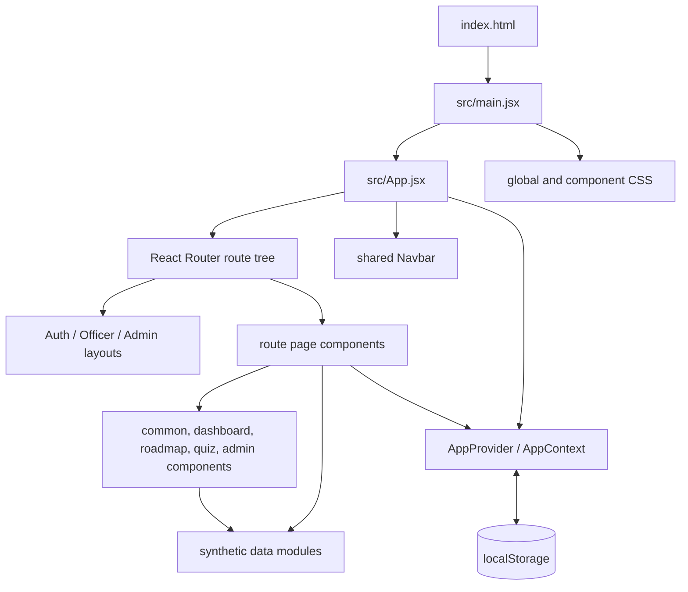
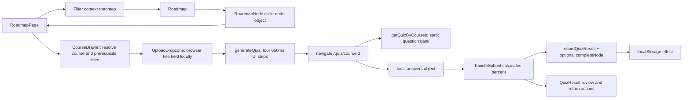

# KushalAI Codebase Field Guide

This is a reverse-engineering guide to the code in this checkout. It follows actual imports, props, callbacks, React state, and browser storage rather than treating the README as a specification.

## Scope and Ground Rules

The inventory covers the 54 application/repository files present before this guide was created: 53 tracked files plus the locally untracked [Navbar.jsx](kushalai-frontend/src/components/common/Navbar.jsx). This guide is the 55th authored file in the checkout. Seven tracked source files are locally modified; this document describes their current contents. It does not attempt to document files installed under `node_modules/`, generated under `dist/`, or Git's internal `.git/` database. Those are dependency/build/repository machinery, not application source. `src/assets/` is not present on disk; the logo is in `public/assets/`.

There are no user-defined JavaScript classes in this project. The UI is composed of function components and hooks. “Objects” below means meaningful application objects (user records, course/node records, state snapshots, form/file values, callback payloads, derived arrays, and context values), not React's private Fiber structures or each short-lived JSX element produced during rendering.

This is a Vite + React single-page demo. It has no backend, database, API client, real authentication, server-side quiz generation, or live iGOT integration. All domain data is bundled mock data. `localStorage` is the only persistence layer. The HTML does request Poppins/Inter from Google Fonts, so fonts are a network resource even though the product data never leaves the browser.

## Architecture at a Glance



The layering is intentionally lightweight:

1. `index.html` gives React a mount point and imports `/src/main.jsx` as a browser module.
2. `main.jsx` loads CSS, creates the React root, enables `StrictMode`, and renders `App`.
3. `App.jsx` installs `AppProvider` and `BrowserRouter`; its routes choose a page and, where applicable, an authorization/layout wrapper.
4. `AppContext.jsx` owns cross-route session state and persistence. Pages consume it through `useApp()`.
5. Page components combine data, local interaction state, and reusable components. Data modules contain static synthetic records and pure calculations.

## Startup and Import Order

```mermaid
sequenceDiagram
  participant Browser
  participant HTML as index.html
  participant Main as main.jsx
  participant App as App.jsx
  participant State as AppProvider
  participant Router as BrowserRouter
  participant Route as AppRoutes
  participant Page as matched page/layout

  Browser->>HTML: Load document
  HTML->>Main: import /src/main.jsx
  Main->>Main: import App and CSS; createRoot(#root)
  Main->>App: render under StrictMode
  App->>State: construct provider and initialize state
  State->>State: loadPersisted() reads localStorage once for initial values
  App->>Router: create browser router
  Router->>Route: resolve current URL
  Route->>Page: render matching element tree
  State->>Browser: effect writes serialized state when dependencies change
```

ES modules evaluate imported modules before the component tree renders. This means module-level mock arrays, derived admin officers/KPIs, route constants, and component definitions are initialized during application startup. React function component bodies then execute on mount and again when their state/props/context change. In development, `React.StrictMode` may intentionally invoke render/effect setup more than once to reveal unsafe side effects; intervals/listeners therefore need cleanup.

## Route and Layout Map

| URL | Route element | Layout / protection | Main inputs |
|---|---|---|---|
| `/` | `Landing` | none | feature constants |
| `/login` | `Login` | `AuthLayout` | `AppContext.loginAsDemo` |
| `/register` | `Register` | `AuthLayout` | page-local selected domains; form browser validation |
| `/profile-setup` | `ProfileSetup` | `AuthLayout` | page-local timer; then demo officer login |
| `/dashboard` | `Dashboard` | `RequireRole('officer')`, `OfficerLayout` | context metrics, static skill data, generated activity |
| `/roadmap` | `RoadmapPage` | `RequireRole('officer')`, `OfficerLayout` | context roadmap, course catalog |
| `/skills` | `SkillPassport` | `RequireRole('officer')`, `OfficerLayout` | user context, static skills |
| `/profile` | `Profile` | `RequireRole('officer')`, `OfficerLayout` | user/context metrics plus local editable form |
| `/quiz/:id` | `Quiz` | `RequireRole('officer')`; standalone page | route id, static course/quiz, context mutations |
| `/admin` | `AdminDashboard` | `RequireRole('admin')`, `AdminLayout` | generated mock roster and derived metrics |
| `/admin/colleagues/:id` | `AdminColleagueDetail` | `RequireRole('admin')`, `AdminLayout` | route id and mock roster lookup |
| `/404`, unmatched URL | `NotFound` | none | router navigation |

`RequireRole` is a render-time guard, not server security: no user sends arrive at a backend. A missing user is redirected to `/login`; a signed-in user of the wrong role is sent to their role's landing route. The route tree is in [App.jsx](kushalai-frontend/src/App.jsx).

## Shared State and Object Lifetimes

### Context state

`AppProvider` in [AppContext.jsx](kushalai-frontend/src/context/AppContext.jsx) owns these values:

| State | Initial source | Writers | Readers / lifecycle |
|---|---|---|---|
| `user` | saved payload or `null` | `loginAsDemo`, `logout` | navbar, role guard, dashboard, profile, skill passport; serialized to storage |
| `disciplineScore` | saved payload or demo officer's score | `completeNode` | dashboard/profile; persisted |
| `disciplineLog` | saved payload or one daily-login entry | login and course completion | dashboard; prepends entries and caps to 8; persisted |
| `roadmap` | saved payload or `roadmapNodes` array | `completeNode`, exposed `setRoadmap` | roadmap screen, quiz; immutable array/object replacements on completion; persisted |
| `quizHistory` | saved payload or static trend history | `recordQuizResult` | dashboard chart/stat and quiz; persisted |
| `courseCompletion` | saved payload or `{completed: 9, inProgress: 3, recommended: 4}` | `completeNode` | dashboard/profile; persisted |
| `toast` | `null` | `showToast`, `clearToast` | ToastHost; not persisted |

`loadPersisted()` reads the single key `kushalai-demo-state-v1`, parses JSON, and returns `null` on absent/invalid data. Each `useState` initializer takes a property from that payload or its fallback. On changes to the six persisted state values, an effect serializes a payload back to `localStorage`. The state arrays/records are passed by reference within React; writers use functional state updates and create replacement arrays/objects rather than mutating the previous snapshot.

`loginAsDemo(role)` selects the shared `demoAdmin` record only for the string `'admin'`; every other role selects `demoOfficer`. It stores that record as `user`. Officer login prepends a `Daily login` log item and creates a success toast, but does not add to `disciplineScore`. `logout()` only sets `user` to `null`; other demo progress remains saved. `completeNode(nodeId)` marks the matching roadmap node completed, derives completed ids, unlocks locked nodes whose prerequisites are all complete, adds 10 to discipline score, adds a completion log entry, and increments completion/decrements in-progress counts. `recordQuizResult(courseTitle, scorePercent)` appends an attempt object and keeps at most six entries (`last five + new`); `courseTitle` is accepted but not used. `showToast(message, variant)` creates `{message, variant, id: Date.now()}`; `clearToast()` sets it to null. `useApp()` returns the provider value or throws if rendered outside `AppProvider`.

The `value` object is memoized with `useMemo` on state values; it contains state plus mutation functions. Components receiving it read the same state snapshot for a render, then rerender when state changes. No reducer, backend synchronization, schema validation, user-specific state partition, or storage migration exists.

### Important domain-object flows

- `demoOfficer` and `demoAdmin` are module-level objects in `mockUsers.js`. `AppContext` stores one as `user`; `Navbar`, pages, and `Avatar` read its properties. No code mutates those singleton records. Profile edits are not written back to them.
- `roadmapNodes` and course records are module-level data. Context initially points to the roadmap array; completion creates new node objects and a new array. A selected node is represented by its `id` in `RoadmapPage`, then resolved back to a current roadmap object each render. Course metadata is looked up by `courseId`.
- A quiz answer map is a page-local object keyed by question id. Each click creates a replacement map. On submit it is read to calculate a score and passed to `QuizResult`; it is not persisted.
- An uploaded browser `File` is held only in `CourseDrawer` state and passed to `UploadDropzone`. The code reads its name and byte size for display. It never reads file bytes, uploads it, or uses it to construct questions.
- Admin `officers`, KPIs, department distribution, and emerging gap counts are built from deterministic synthetic values at module evaluation or helper invocation. The admin filters create a derived visible array; they do not modify the source roster.

## Major Workflows

### Login and registration

```mermaid
sequenceDiagram
  participant User
  participant Login
  participant Context as AppProvider
  participant Storage as localStorage
  participant Router
  User->>Login: submit form or choose demo role
  Login->>Context: loginAsDemo(role)
  Context->>Context: set user; officer path updates log and toast
  Context->>Router: Login calls navigate('/dashboard' or '/admin')
  Context->>Storage: effect serializes state after render
  Router->>Context: RequireRole reads user
  Router->>User: render role layout and page
```

`Login.handleSubmit(event)` prevents the browser submit and logs in as officer regardless of the typed email/password. `handleDemo(role)` calls the same context function and picks the destination from role. Inputs are local to `Login`; the remember checkbox is visual state only. `Register` keeps selected chips in a local array, but the text inputs are uncontrolled and the submitted field values are not captured. Its submit handler only prevents native navigation and routes to `/profile-setup`. That screen animates four labels on a timer, then signs in the demo officer and navigates to `/dashboard`; it does not send registration data or calculate an actual profile.

### Roadmap, course drawer, upload simulation, quiz, result



`RoadmapPage` starts with `All` domain/status and no selected node. Filter changes only derive `filtered`; clicking a node stores its id. The page resolves the selected node, course, and prerequisite titles from data modules and passes them to `CourseDrawer`. `Roadmap` calculates prerequisite connector pairs and switches to a sorted vertical rendering below 720px; on desktop it draws SVG curves using percentage positions. `RoadmapNode` receives a node/course and calls `onClick(node)`.

`CourseDrawer` shows course and node data. Locked nodes disable course/quiz actions and omit the upload section, but the component does not enforce prerequisite security outside that UI. A selected `File` enables `generateQuiz()`, which advances `stepIndex` every 650ms and eventually exposes a “Start quiz” button. The generated quiz is not derived from the file: `Quiz` independently looks up the pre-baked record by course id. `goToQuiz()` closes/resets the drawer and navigates to `/quiz/:id`.

In `Quiz`, `useParams()` supplies course id. `getCourseById` and `getQuizByCourseId` resolve the static records. `selectOption(optionIndex)` ignores repeat answers and replaces the answers object. The Next button only enables after the current question has an answer; Previous changes the index. Submit counts correct answers, computes a rounded percent, records the attempt, and completes the matching roadmap node unless already completed. There is no minimum passing score. The result view recounts answers, renders `QuizResult`, and provides roadmap/dashboard navigation. If no course or quiz bank exists, `EmptyState` links back to the roadmap.

### Dashboard and skill passport

`Dashboard` reads user, discipline score/log, quiz history, course counts, and roadmap from context. It derives greeting/time, first name, completion percentage, and active gaps. It calls `generateActivityHeatmap(14)` on render to create daily activity objects, and `domainAverage`/`statusFromMastery` to display static competency domains. `ActivityHeatmap` groups day objects into columns; `QuizTrendChart` reads the last two history values and passes all history to Recharts. “Continue roadmap” and “View full passport” call router navigation. Quiz and discipline changes flow into the context-backed metrics; static `mockSkills` mastery values do not change when a quiz is completed.

`SkillPassport` reads user and static skill domains. `openDomain` is page-local id state, initially `technical`; each domain button either toggles that id or collapses it to null. `domainAverage`, `overallScore`, and `statusFromMastery` are pure calculations over static competencies. Expanding a domain reveals the competency records and evidence strings; no edit or persistence occurs.

### Admin analysis and colleague detail

`mockAdmin.js` constructs 12 fictional officer objects from names, departments, designations, and skill names. `seededMastery(seed, offset)` deterministically returns a bounded score. Each row gets `skillMastery`, the two lowest gaps, discipline/latest quiz/course counts, status, and detail lists. `adminKpis`, `departmentDistribution`, and `emergingSkillGaps()` summarize this roster.

`AdminDashboard` uses local `search`, `department`, and `status` state. `useMemo` filters the static roster when any filter changes. It passes all officers to `Heatmap`, gap counts to `EmergingSkills`, and the filtered list to `ColleagueTable`. `ColleagueTable` row clicks navigate to `/admin/colleagues/:id`. `AdminColleagueDetail` uses the route id in `getOfficerById`; it renders that object's fields and skill mastery or an empty state if no record matches. Neither admin page mutates employee data.

### Profile, navigation, logout, and transient messages

`Profile` copies four user fields into local `form` state at mount. `update(field, value)` replaces that form object. The Edit/Done button only toggles whether inputs are disabled; it does not commit values to context, so changes disappear if the page unmounts or reloads, and the navbar continues showing the original `user` values.

`Navbar` is rendered above the route tree. It reads `user/logout` from context, chooses officer/admin/public links, resets its mobile menu when `location.pathname` changes, and calls `logout()` then navigates to `/login`. Desktop and mobile use the same link constants. Notification is currently a button with no handler. `ToastHost` reads context toast state, starts a 3.2-second timer to clear it, and cleans up the timer when toast changes or the host unmounts. ToastHost is mounted by officer/admin layouts, so a login success toast appears after navigation into the officer layout.

## File-by-File Reference

### Repository and build files

#### [.gitignore](.gitignore)

- **Why here:** repository-root ignore policy applies to the frontend's nested build folders too.
- **Execution/imports:** Git consults it during status/add operations; no JavaScript imports it.
- **Responsibilities/data:** excludes `node_modules/`, `dist/`, `build/`, local `.env*` except `.env.example`, npm/yarn/pnpm debug logs, and common OS metadata. It does not ignore `package-lock.json`.
- **Functions/objects:** none.

#### [README.md](README.md)

- **Why here:** repository landing text. It currently contains only two `# KushalAI` headings, not technical setup or architecture.
- **Execution/imports/responsibilities:** read by people only; no code imports it and it defines no symbols or data consumed at runtime.

#### [UNDERSTANDING.md](UNDERSTANDING.md)

- **Why here:** repository root makes the reverse-engineering guide discoverable alongside the root README while it covers both repository metadata and the frontend package.
- **Execution/imports:** documentation only; it is not loaded by Vite, imported by JavaScript, or required for a build.
- **Responsibilities/data:** records the architecture, import graph, state lifetimes, workflows, per-file responsibilities, and verified limitations. It creates no runtime objects or functions.

#### [kushalai-frontend/README.md](kushalai-frontend/README.md)

- **Why here:** frontend-specific setup, routes, prototype assumptions, and a top-level source map belong beside `package.json`.
- **Execution/imports:** human documentation only. It documents `npm install`, `npm run dev/build/preview`, demo login roles, route names, mock-data assumptions, and design tokens.
- **Caveat:** its structure section predates the shared Navbar and some details are summary-level; source code is authoritative.

#### [kushalai-frontend/package.json](kushalai-frontend/package.json)

- **Why here:** npm project metadata and script/dependency contract for the Vite frontend.
- **Execution/imports:** npm reads it for `dev` (`vite`), `build` (`vite build`), and `preview` (`vite preview`); it is not imported by browser code.
- **Data:** React/ReactDOM, React Router, Lucide icons, Recharts, Framer Motion dependencies; Vite and React plugin dev dependencies. `type: module` makes config/scripts use ES module semantics. No custom test/lint scripts exist.

#### [kushalai-frontend/package-lock.json](kushalai-frontend/package-lock.json)

- **Why here:** npm's reproducible resolved dependency graph accompanies package.json.
- **Execution/imports:** npm install/ci reads and updates it; the browser never imports it. It records exact package versions, resolution URLs, integrity hashes, dependency edges, and package metadata; it contains no app functions or runtime objects.

#### [kushalai-frontend/requirements.txt](kushalai-frontend/requirements.txt)

- **Why here:** setup notes are kept near the frontend package; despite the `.txt` name it is not a Python dependency manifest.
- **Execution/imports:** no npm or browser code imports it. It documents Node.js >=18, npm >=9, npm commands and dependencies, and explicitly says there is no backend/API or external service.

#### [kushalai-frontend/vite.config.js](kushalai-frontend/vite.config.js)

- **Why here:** Vite configuration is discovered from the frontend package root.
- **Imported by:** Vite CLI, not application code. Imports `defineConfig` and `@vitejs/plugin-react`.
- **Symbols/data:** default-exported config object enables the React plugin, serves on port 5173, and opens a browser. No custom proxies, aliases, or environment loading are configured.

#### [kushalai-frontend/index.html](kushalai-frontend/index.html)

- **Why here:** Vite's HTML entry document sits at the package root.
- **Execution/imports:** browser parses it first; it loads the favicon from `public/assets/kushalAI_logo.png`, fonts from Google Fonts, creates `<div id="root">`, then loads `/src/main.jsx` with `type="module"`.
- **Data out:** document title, viewport metadata, font requests and mount point. The `#root` element is the object React attaches to; there is no application code in this file.

#### [kushalai-frontend/public/assets/kushalAI_logo.png](kushalai-frontend/public/assets/kushalAI_logo.png)

- **Why here:** Vite copies `public/` assets to the site root without module imports.
- **Consumers:** `index.html` favicon and the shared Navbar image.
- **Data:** static raster image only; it creates no JavaScript objects and is served by URL `/assets/kushalAI_logo.png`.

### Application bootstrap, routes, and layouts

#### [kushalai-frontend/src/main.jsx](kushalai-frontend/src/main.jsx)

- **Why here:** conventional browser entry module, separate from route definitions.
- **Executed by:** `index.html`. Imports React, `createRoot`, `App`, `globals.css`, and `components.css`.
- **Objects/functions:** `document.getElementById('root')` supplies the DOM mount node; `createRoot` creates the React root; `StrictMode` and `<App />` create the root element tree. No value is exported. Removing it leaves the HTML mount point empty.

#### [kushalai-frontend/src/App.jsx](kushalai-frontend/src/App.jsx)

- **Why here:** root composition boundary owns route definitions and shared app shells.
- **Imported by:** `main.jsx`. Imports React Router primitives, `AppProvider/useApp`, `Navbar`, all layout and route page components.
- **`RequireRole({role, children})`:** called while a protected route element renders. Receives required role and nested layout/page element; reads `user` via `useApp`; returns `<Navigate replace>` when absent/wrong, otherwise returns `children`. It creates no domain object and mutates no state. Removing it exposes protected pages to any browser user (though all data is mock).
- **`AppRoutes()`:** renders shared `<Navbar />` and `<Routes>`; Router calls it beneath `BrowserRouter`. Route declarations map URL patterns to page/layout elements. No return other than React elements.
- **`App()`:** exported root component; wraps route tree in `AppProvider` and `BrowserRouter`. These providers create context/router instances for the app subtree. Without App, `main.jsx` has no UI.
- **Data flow:** route params go to hooks such as `useParams`; context and router are provided to all descendants.

#### [kushalai-frontend/src/components/common/Navbar.jsx](kushalai-frontend/src/components/common/Navbar.jsx) (untracked in this checkout)

- **Why here:** shared navigation is a common UI component and is rendered once above all routes from `AppRoutes`.
- **Imports:** React `useEffect/useState`; Router `Link/NavLink/useLocation/useNavigate`; Lucide icons; `useApp`; `Avatar`.
- **Constants:** `OFFICER_LINKS` and `ADMIN_LINKS` are route/label descriptors. They are mapped into desktop/mobile links.
- **`Navbar()`:** reads current user/logout and URL; stores `mobileOpen` locally; picks links/home path by role; resets mobile state on pathname changes. Local `handleLogout()` calls context logout and then navigation. Render passes link descriptors and current-user fields into React Router/UI components; event handlers receive no domain object except the selected link closure. `NavLink` supplies `isActive` to the class callback. The bell is currently inert.
- **Object lifecycle:** `mobileOpen` is a boolean state; location change resets it. JSX callbacks close over current route/user. No user record is modified. The component's placement before `<Routes>` makes the sticky header available on public, auth, officer, admin, quiz, and not-found routes.

#### [kushalai-frontend/src/layouts/AuthLayout.jsx](kushalai-frontend/src/layouts/AuthLayout.jsx)

- **Why here:** shared visual frame for `/login`, `/register`, and `/profile-setup`.
- **Imported by:** `App.jsx`; imports React and `Outlet`.
- **`AuthLayout()`:** returns a two-column branding/form layout; React Router injects the matching child at `<Outlet />`. CSS-in-JSX hides the brand panel at <=900px. It owns no state and does not alter form data. Because the shared Navbar is outside it, its `minHeight: 100vh` begins below the navbar in normal flow.

#### [kushalai-frontend/src/layouts/OfficerLayout.jsx](kushalai-frontend/src/layouts/OfficerLayout.jsx)

- **Why here:** common officer-route content frame and toast host.
- **Imported by:** `App.jsx`; imports React, `Outlet`, `ToastHost`.
- **`OfficerLayout()`:** renders a minimum-height wrapper, constrained/padded `<main>` with the matched page, and `ToastHost`. It receives no props from the route; Outlet receives the nested page. No state or domain mutation. It does not contain the navbar; Navbar is global.

#### [kushalai-frontend/src/layouts/AdminLayout.jsx](kushalai-frontend/src/layouts/AdminLayout.jsx)

- **Why here:** common admin-route content frame and toast host.
- **Imported by:** `App.jsx`; imports React, `Outlet`, `ToastHost`.
- **`AdminLayout()`:** renders `<main>` with the nested admin page plus toast host. The protected parent route supplies it. No state or user changes. Admin navigation/account controls come from global Navbar.

### Context and synthetic data

#### [kushalai-frontend/src/context/AppContext.jsx](kushalai-frontend/src/context/AppContext.jsx)

- **Why here:** separates cross-page state from presentation and keeps updates usable from deeply nested children.
- **Imported by:** `App.jsx`, Navbar, layouts/components/pages. Imports React context/state/effect/memo hooks and the user, roadmap, quiz seed data modules.
- **Constants/objects:** `STORAGE_KEY`; `AppContext`; context `value` object. `AppProvider({children})` initializes seven state values and creates the provider subtree. The provider effect builds a persistence payload and writes JSON. Named functions and effects are detailed under “Shared State and Object Lifetimes”.
- **`loadPersisted()`:** no arguments; reads/parses storage; returns parsed object or null after absent/bad data. JSON parse creates the in-memory payload object. It changes no state itself.
- **`AppProvider({children})`:** receives the subtree; each `useState` setter owns one state cell. Functions `showToast`, `loginAsDemo`, `logout`, `completeNode`, `recordQuizResult` close over setters; the `useMemo` result is passed to context consumers. No direct backend communication.
- **`useApp()`:** no arguments; calls `useContext(AppContext)` and returns context value; throws a descriptive Error if no provider exists. Removing it would force consumers to import provider internals or lose shared state access.

#### [kushalai-frontend/src/data/mockUsers.js](kushalai-frontend/src/data/mockUsers.js)

- **Why here:** keeps role-specific demo identity records away from UI.
- **Imported by:** `AppContext`. Exports module-level `demoOfficer`, `demoAdmin`, and `findDemoUserByRole(role)`.
- **`demoOfficer` / `demoAdmin`:** static user-shaped objects; provider selects one into `user`; view components read fields, not mutate the records.
- **`findDemoUserByRole(role)`:** role string in, matching admin only for `'admin'`, otherwise officer object out. Current AppContext selects directly and does not call this helper.

#### [kushalai-frontend/src/data/mockCourses.js](kushalai-frontend/src/data/mockCourses.js)

- **Why here:** central catalogue keyed by course ids used across roadmap, drawer and quiz.
- **Imported by:** Roadmap, RoadmapPage, Quiz, CourseDrawer. Exports `courses` (13 static course objects) and `getCourseById(id)`.
- **`getCourseById(id)`:** searches the catalog and returns the matching object or `undefined`; no cloning or mutation. Course records carry title, domain, skill, source, difficulty, duration, description, mastery thresholds, and recommendation reason. A node stores only a `courseId`, then screens resolve the full course object at render time.

#### [kushalai-frontend/src/data/mockQuizzes.js](kushalai-frontend/src/data/mockQuizzes.js)

- **Why here:** pre-baked quiz banks and dashboard activity seeds are data, not UI.
- **Imported by:** AppContext, Dashboard, CourseDrawer, Quiz. Exports `quizzes`, `getQuizByCourseId(courseId)`, `quizTrendHistory`, and `generateActivityHeatmap(weeks=14)`.
- **`getQuizByCourseId`:** dictionary lookup; returns quiz object or null. Each question has id, prompt, options, correct option index, and explanation.
- **`generateActivityHeatmap(weeks)`:** creates a fresh chronological array of `{date, level}` objects for `weeks*7` days; uses current date and a deterministic date-based formula, not random data. It does not change its inputs or global state.
- **`quizTrendHistory`:** seed array of attempt/score objects; provider uses it only as its initial fallback.

#### [kushalai-frontend/src/data/mockRoadmap.js](kushalai-frontend/src/data/mockRoadmap.js)

- **Why here:** roadmap graph relationships and layout coordinates are shared domain data.
- **Imported by:** AppContext, Roadmap, RoadmapPage. Exports `roadmapNodes`, `connectorsForNodes(nodes)`, and `prereqTitlesFor(node,nodes,coursesById)`.
- **`roadmapNodes`:** 13 node objects (`id`, `courseId`, `status`, `domain`, `prereqs`, x/y percentages); initial context value uses this array.
- **`connectorsForNodes(nodes)`:** creates an id-to-node object and link objects `{from,to}` for each resolvable prereq; returns a new array, does not mutate nodes.
- **`prereqTitlesFor(...)`:** for each prerequisite id, finds its node, passes its course id to the injected lookup function, returns available titles after filtering missing ones. The injected function makes the helper independent of catalog implementation.

#### [kushalai-frontend/src/data/mockSkills.js](kushalai-frontend/src/data/mockSkills.js)

- **Why here:** static officer competencies and score thresholds underpin passport/dashboard/admin views.
- **Imported by:** Dashboard, SkillPassport, Profile, AdminColleagueDetail, admin Heatmap/mockAdmin.
- **Exports:** `statusFromMastery(mastery)` maps >=85 Mastered, >=70 Proficient, >=45 Developing, otherwise Gap; `skillDomains` nested competency objects; `domainAverage(domain)` computes rounded mean of a domain's competencies; `overallScore()` flattens every domain and returns a rounded global mean; `heatmapSkills` is the admin heatmap column list.
- **Data lifecycle:** functions return strings/numbers; arrays/records are static module data. They are independent of quiz/context mastery updates.

#### [kushalai-frontend/src/data/mockAdmin.js](kushalai-frontend/src/data/mockAdmin.js)

- **Why here:** generates a repeatable fictional staff roster and summary metrics for admin pages.
- **Imports:** `heatmapSkills` from `mockSkills.js`. Imported by AdminDashboard and AdminColleagueDetail.
- **Constants/functions:** `departments`, `designations`, `names`; private `seededMastery(seed,offset)` calculates deterministic bounded scores. Module-level `officers = names.map(...)` creates each roster object, skill map, top two gaps, status, and learning lists. `getOfficerById(id)` returns a matching object or undefined. `adminKpis` is computed once from roster. `emergingSkillGaps()` creates count records sorted descending each call. `departmentDistribution` maps departments to counts at module initialization.
- **Mutation/data flow:** calculations read source arrays; no roster edits. `officers` is passed into heatmap/table/detail lookup; filters create a separate visible array.

### Reusable components

#### [kushalai-frontend/src/components/common/UI.jsx](kushalai-frontend/src/components/common/UI.jsx)

- **Why here:** shared presentational primitives avoid duplicating button/form/card/status markup.
- **Imported by:** most pages and feature components. Imports React only; styling comes from `components.css`.
- **Exports and contract:** `Button({variant='primary',size='md',block,children,className='',...rest})` builds a class string and forwards remaining button props; returns a button. `Card({children,className='',flush=false,hover=false,style,...rest})` computes card classes and forwards style/attributes. `STATUS_MAP` maps skill and roadmap states to CSS badge classes; `StatusBadge({status,label})` uses fallback neutral and displays label-or-status. `Badge({children,tone='neutral'})` selects tone class. `Pill({active,children,...rest})` returns a button; click behavior is supplied by caller.
- **Form primitives:** `Field({label,children,hint})` wraps label/children/hint; `Input(props)` forwards props to an input with class; `Select({children,...rest})` does the same for select. They own no input state; caller decides controlled/uncontrolled behavior.
- **Visual helpers:** `ProgressBar({value})` clamps visual width to 0..100 and returns ARIA progress markup; `CircularProgress({value,size=120,stroke=12,label,sublabel})` computes radius/circumference/dash offset and creates SVG circles; `StatCard({icon,label,value,sub})` composes `Card`; `Avatar({name,size=40})` splits a name, takes two initials, uppercases, returns a fixed-size div. `Tabs({tabs,active,onChange})` maps tab descriptors and calls `onChange(t.value)`; `Skeleton({width,height,radius,style})` passes size/style through; `EmptyState({icon,title,message,action})` conditionally renders icon/message/action. None creates or mutates domain state.

#### [kushalai-frontend/src/components/common/Drawer.jsx](kushalai-frontend/src/components/common/Drawer.jsx)

- **Why here:** common right-side modal surface used by course detail.
- **Imported by:** `CourseDrawer`; imports React effect and Lucide `X`.
- **`Drawer({open,onClose,title,children})`:** installs a document keydown listener only while open; local `onKey(event)` calls optional `onClose` on Escape; effect cleanup always removes listener. If closed it returns null. If open it returns overlay and `role=dialog` drawer containing caller content. Overlay mousedown calls `onClose`; no focus trap/body-scroll lock is implemented. It receives, but does not alter, course state.

#### [kushalai-frontend/src/components/common/Modal.jsx](kushalai-frontend/src/components/common/Modal.jsx)

- **Why here:** reusable centered dialog primitive; currently available for page flows needing confirmation/content.
- **Imported by:** no current feature page imports it (it is a reusable leaf). Imports React and Lucide `X`.
- **`Modal({open,onClose,title,children,footer})`:** Escape effect listener/cleanup parallels Drawer. Closed returns null. Open returns overlay, dialog, title, children, optional footer. Overlay closes only when the event target is the overlay itself; inner clicks do not bubble into a close. No state is owned.

#### [kushalai-frontend/src/components/common/PageHeader.jsx](kushalai-frontend/src/components/common/PageHeader.jsx)

- **Why here:** consistent heading/eyebrow/subtitle/action arrangement for content pages.
- **Imported by:** RoadmapPage, SkillPassport, Profile, AdminDashboard.
- **`PageHeader({eyebrow,title,subtitle,action})`:** conditionally renders eyebrow/subtitle and passes action through as a React child. It has no state, data lookup, or callbacks of its own.

#### [kushalai-frontend/src/components/common/ToastHost.jsx](kushalai-frontend/src/components/common/ToastHost.jsx)

- **Why here:** renders transient app feedback outside individual forms/pages.
- **Imported by:** OfficerLayout and AdminLayout; imports `useApp`.
- **`ToastHost()`:** reads `{toast,clearToast}`. Effect starts a 3200ms timeout when a toast exists and cleanup cancels it on dependency change/unmount. Null toast returns null; otherwise message/variant become CSS classes. It does not create the toast object; `showToast` does that in context.

#### [kushalai-frontend/src/components/admin/ColleagueTable.jsx](kushalai-frontend/src/components/admin/ColleagueTable.jsx)

- **Why here:** admin roster table is isolated from dashboard filtering.
- **Imported by:** AdminDashboard. Imports router navigation and common Avatar/Badge.
- **`STATUS_TONE`:** maps On Track/Steady/Needs Attention to badge tones. `ColleagueTable({officers})` maps passed rows into table cells, uses `navigate('/admin/colleagues/'+id)` on row click, and renders an empty row when array length is zero. It does not filter or modify officers; navigation call receives an id captured by the row handler.

#### [kushalai-frontend/src/components/admin/EmergingSkills.jsx](kushalai-frontend/src/components/admin/EmergingSkills.jsx)

- **Why here:** displays aggregated skill gap counts as ranked bars.
- **Imported by:** AdminDashboard. `EmergingSkills({data})` computes a denominator max (at least 1), maps skill/count records into labels and proportional widths, returns presentational markup. No mutations/callbacks.

#### [kushalai-frontend/src/components/admin/Heatmap.jsx](kushalai-frontend/src/components/admin/Heatmap.jsx)

- **Why here:** admin-specific officer-by-skill comparison view.
- **Imported by:** AdminDashboard. Imports React state and `heatmapSkills`.
- **`cellColor(value)`:** returns `{bg,text}` style descriptor for score thresholds. `Heatmap({officers})` owns a hovered-cell object or null, limits rows to first 12, and maps each cell using officer skill mastery. Mouse enter creates `{officer,skill,value}`, leave clears it; that descriptor drives the caption. Source officers are read-only.

#### [kushalai-frontend/src/components/dashboard/ActivityHeatmap.jsx](kushalai-frontend/src/components/dashboard/ActivityHeatmap.jsx)

- **Why here:** dashboard-specific calendar-like daily activity visualization.
- **Imported by:** Dashboard. `LEVEL_COLORS` maps level 0..4 to colors. `ActivityHeatmap({days})` creates week slices in a new array, then maps day objects to squares/tooltips and colors; no source mutation or callback.

#### [kushalai-frontend/src/components/dashboard/QuizTrendChart.jsx](kushalai-frontend/src/components/dashboard/QuizTrendChart.jsx)

- **Why here:** dashboard adapter from quiz history to a compact chart.
- **Imported by:** Dashboard. Imports Recharts `LineChart`, `Line`, `ResponsiveContainer`, `YAxis`, `Tooltip`.
- **`QuizTrendChart({data})`:** reads latest/previous entries, derives score delta, passes the same data array into Recharts and displays tooltip formatting. Does not mutate it. Assumes nonempty data because it accesses `latest.score`.

#### [kushalai-frontend/src/components/roadmap/Roadmap.jsx](kushalai-frontend/src/components/roadmap/Roadmap.jsx)

- **Why here:** renders the prerequisite graph at desktop and a readable ordered list on small screens.
- **Imported by:** RoadmapPage. Imports React state/effect, RoadmapNode, `connectorsForNodes`, `getCourseById`.
- **`useIsMobile()`:** internal hook initializes from `window.innerWidth < 720`, adds a resize listener, updates boolean state, removes listener on unmount, returns that boolean. Browser-only; no SSR guard.
- **`connectorColor(status)`:** returns primary for completed, gray otherwise. `Roadmap({nodes,onNodeClick})` creates link array from nodes. Mobile path sorts a copy by y then x and renders nodes/connectors vertically; desktop path renders SVG paths and absolutely positioned nodes. Node clicks pass the actual node object to `onNodeClick`. No roadmap status mutation.

#### [kushalai-frontend/src/components/roadmap/RoadmapNode.jsx](kushalai-frontend/src/components/roadmap/RoadmapNode.jsx)

- **Why here:** one visual/clickable representation for each roadmap node.
- **Imported by:** Roadmap. `STYLES` and `ICONS` map status to visual config/Lucide component. `RoadmapNode({node,course,onClick,style})` creates a button with node title/status; click delegates to parent; passed style controls position. Mouse handlers change the icon-circle DOM element's transform directly, not React state. Node/course objects remain read-only.

#### [kushalai-frontend/src/components/roadmap/CourseDrawer.jsx](kushalai-frontend/src/components/roadmap/CourseDrawer.jsx)

- **Why here:** details, prerequisite explanation, course actions, and mocked quiz generation for selected node.
- **Imported by:** RoadmapPage. Imports router, Lucide, Drawer/UI/UploadDropzone, quiz lookup, context.
- **Constants/functions:** `PROCESSING_STEPS`; `CourseDrawer({node,course,prereqTitles,open,onClose})` owns file, processing, stepIndex, quizReady state. Early null when node/course absent. `resetUploadState()` clears the four local state values; `handleClose()` resets then calls parent close; `generateQuiz()` starts a four-step interval; `goToQuiz()` closes then navigates by course id. `getQuizByCourseId` only checks whether a static quiz exists. The “Go to course” action only calls `showToast` with a demo-link message.
- **Lifecycle caveat:** `generateQuiz()` clears its interval when all four steps complete, but closing/unmounting during processing does not clear that interval. `resetUploadState()` resets React state only. If the drawer is dismissed mid-run, the timer can continue calling state setters after the drawer is no longer visible.
- **Child helpers:** `Card_WhyRecommended({course,gap})` displays mastery and reason; `Info({label,value})` prints one pair. They return JSX, do not mutate props. `file` is never read beyond display metadata in UploadDropzone.

#### [kushalai-frontend/src/components/roadmap/UploadDropzone.jsx](kushalai-frontend/src/components/roadmap/UploadDropzone.jsx)

- **Why here:** encapsulates file chooser, drag/drop, and selected-file presentation.
- **Imported by:** CourseDrawer. Imports React ref/state and Lucide file/upload icons.
- **`UploadDropzone({file,onFileSelected,onClear})`:** `inputRef` points to hidden file input; `dragActive` drives CSS. `handleFiles(fileList)` takes the first File and passes it upward. Drop/choose/click handlers prevent browser default/propagation as needed. With file, displays name and rounded-up-ish KB via `toFixed(0)` and calls `onClear`; without file, accepts `.pdf,.jpg,.jpeg,.png`. No MIME/content validation, upload, parsing, or persistence occurs.

#### [kushalai-frontend/src/components/quiz/QuizProgress.jsx](kushalai-frontend/src/components/quiz/QuizProgress.jsx)

- **Why here:** displays question position and percentage independent of quiz page controls.
- **Imported by:** Quiz. `QuizProgress({current,total})` calculates `round(current/total*100)` for label and passes the ratio to ProgressBar. No state; assumes total > 0.

#### [kushalai-frontend/src/components/quiz/QuizQuestion.jsx](kushalai-frontend/src/components/quiz/QuizQuestion.jsx)

- **Why here:** option rendering, selection feedback, correct/incorrect styling and explanation.
- **Imported by:** Quiz. `QuizQuestion({question,selected,onSelect,revealed})` maps option strings with indices, derives selected/correct flags and styles, disables all options after reveal, and calls `onSelect(idx)` before reveal. It receives one question object and does not own answer state. The explanation is shown after an answer is selected.

#### [kushalai-frontend/src/components/quiz/QuizResult.jsx](kushalai-frontend/src/components/quiz/QuizResult.jsx)

- **Why here:** summary and question-by-question review separated from quiz progression.
- **Imported by:** Quiz. `verdict(score)` maps score bands to text. `QuizResult({quiz,answers,scorePercent,onReturnToRoadmap,onBackToDashboard})` recalculates correct count, maps question records and answer indices, and calls navigation callbacks from buttons. Local `Stat({label,value,tone})` chooses a text color and returns one metric. It does not update quiz/context state.

### Route pages

#### [kushalai-frontend/src/pages/Landing.jsx](kushalai-frontend/src/pages/Landing.jsx)

- **Why here:** public route `/`; introduces the prototype and links into auth flow.
- **Imported by:** App route table. Imports React, Router Link, Lucide feature icons, Button/Card.
- **`FEATURES`:** three static feature descriptors containing icon component/title/text. `Landing()` maps descriptors into cards; buttons navigate to register/login through Link. No state/context interaction.

#### [kushalai-frontend/src/pages/Login.jsx](kushalai-frontend/src/pages/Login.jsx)

- **Why here:** mock credential entry and role-selection demo buttons.
- **Imported by:** App's AuthLayout child route. Imports React state, Link/useNavigate, common fields/button, `useApp`.
- **`Login()`:** stores email/password and remember checkbox locally; `handleSubmit(event)` prevents submit, calls `loginAsDemo('officer')`, then navigates dashboard. `handleDemo(role)` calls context login and navigates admin/dashboard. Values do not validate against a service; controlled email/password only affect their fields. Removing handlers removes all login transitions.

#### [kushalai-frontend/src/pages/Register.jsx](kushalai-frontend/src/pages/Register.jsx)

- **Why here:** registration-form screen under AuthLayout.
- **Imported by:** App's AuthLayout child route. Imports React state, Link/useNavigate, Button/Field/Input/Pill.
- **`DOMAINS`:** fixed chip labels. `Register()` owns selected domain labels initialized to Python and SQL. `toggleDomain(domain)` functionally returns a new array, removing existing or appending absent value. `handleSubmit(event)` prevents native submit and navigates to `/profile-setup`. Input values are uncontrolled and neither those values nor selected domains are passed to context/setup; this is an interaction prototype, not account creation.

#### [kushalai-frontend/src/pages/ProfileSetup.jsx](kushalai-frontend/src/pages/ProfileSetup.jsx)

- **Why here:** simulated onboarding progress after registration.
- **Imported by:** App's AuthLayout child route. Imports React effects/state, router navigation, check icon, context.
- **`STEPS`:** four display strings. `ProfileSetup()` holds `stepIndex/done`. First effect starts a 900ms interval, advances labels, sets done on fourth tick, and clears interval on completion/unmount. Second effect watches `done`, waits another 900ms, calls `loginAsDemo('officer')`, navigates dashboard, and cleans up timeout. It creates no profile object and receives no Register form data.

#### [kushalai-frontend/src/pages/Dashboard.jsx](kushalai-frontend/src/pages/Dashboard.jsx)

- **Why here:** officer landing metrics and links to roadmap/passport.
- **Imported by:** protected Officer route. Imports router, UI, dashboard visualizations, context, skill calculations and heatmap generator.
- **`Dashboard()`:** reads user and progress state; derives `activity`, active static gaps, completion percent, local time greeting, and first name. Renders values and passes activity/history to child components. Inline navigation callbacks go to roadmap/skills. It makes no state writes; data changes originate in context actions.

#### [kushalai-frontend/src/pages/RoadmapPage.jsx](kushalai-frontend/src/pages/RoadmapPage.jsx)

- **Why here:** route controller for filtering, selecting, and opening course details.
- **Imported by:** protected Officer route. Imports React local state, PageHeader/Pill, Roadmap/CourseDrawer, context, course and prerequisite lookups.
- **Constants:** `DOMAIN_FILTERS`; `STATUS_FILTERS` labels map UI “In progress” to status `current`. `RoadmapPage()` stores two filters and selected node id; derives filtered nodes and resolves selected node/course/prerequisite titles. Pill click handlers update filters; roadmap click stores id; drawer close clears id. No mutations to roadmap itself.

#### [kushalai-frontend/src/pages/Quiz.jsx](kushalai-frontend/src/pages/Quiz.jsx)

- **Why here:** one route handles every course quiz by route id.
- **Imported by:** App route `/quiz/:id` protected for officer; imports React state, router params/navigation, quiz UI, static lookups, context, Lucide file icon.
- **`Quiz()`:** reads id and context roadmap/actions, looks up course/bank, owns index/answers/submitted. `selectOption(optionIndex)` blocks re-answering and creates replacement answers object. `handleSubmit()` calculates correct count and score, records history, finds matching node and completes unless already completed, then sets submitted. Inline next/previous callbacks adjust index; result callbacks navigate. Objects passed to child components are static quiz/question records plus current answer values. A quiz may be directly opened by known id; page itself does not test roadmap lock status.

#### [kushalai-frontend/src/pages/SkillPassport.jsx](kushalai-frontend/src/pages/SkillPassport.jsx)

- **Why here:** expandable competency-domain view.
- **Imported by:** protected Officer route. Imports local state, icon, PageHeader/UI, context user and skill calculations.
- **`SkillPassport()`:** stores one open domain id; renders overall static score and domain summaries; click toggles the clicked id or null. Nested competency data is read-only. No context updates.

#### [kushalai-frontend/src/pages/Profile.jsx](kushalai-frontend/src/pages/Profile.jsx)

- **Why here:** profile summary and local edit interaction.
- **Imported by:** protected Officer route. Imports local state, icons, PageHeader/UI, context values and skill overall score.
- **`Profile()`:** initializes `editing` and a form object from current user once. `update(field,value)` replaces a form snapshot using object spread. Edit/Done toggles disabled state. The form object does not flow into AppContext or localStorage, so edits are discarded on remount/reload and don't change Navbar identity. Summary fields read directly from original context user.

#### [kushalai-frontend/src/pages/AdminDashboard.jsx](kushalai-frontend/src/pages/AdminDashboard.jsx)

- **Why here:** admin workforce analytics route.
- **Imported by:** protected Admin route. Imports React useMemo/state, icons, PageHeader/UI, admin charts/table, mock roster/KPIs.
- **Constants:** `DEPARTMENTS` derives unique roster departments with All; `STATUSES` provides three status choices plus All. `AdminDashboard()` owns search/department/status. `filtered` memo filters by case-insensitive name substring and exact department/status. `gaps` calls emergingSkillGaps. Passes source officers to Heatmap, gap objects to EmergingSkills, filtered records to ColleagueTable. Input/select callbacks only update local filters.

#### [kushalai-frontend/src/pages/AdminColleagueDetail.jsx](kushalai-frontend/src/pages/AdminColleagueDetail.jsx)

- **Why here:** read-only detail route for an admin roster row.
- **Imported by:** protected Admin route. Imports params/navigation, common UI, mock lookup/skill labels, Lucide icons.
- **`AdminColleagueDetail()`:** gets `id` from URL, calls `getOfficerById`, renders EmptyState plus back navigation if missing, otherwise reads officer fields/mastery/lists into cards and progress bars. It never edits the record. Note both `ArrowLeft` and `UserX` are imported from lucide-react in separate import declarations.

#### [kushalai-frontend/src/pages/NotFound.jsx](kushalai-frontend/src/pages/NotFound.jsx)

- **Why here:** both explicit `/404` and unmatched path fallback.
- **Imported by:** App. Imports React, router navigation, Compass, Button/EmptyState.
- **`NotFound()`:** creates navigate function and returns centered empty state; action navigates to `/`. No state/data changes.

## Removal Impact Index

The file sections above describe arguments, callers, timing, created/returned values, mutation, and architecture role. This index answers the complementary debugging question: if a named function/component/helper disappears, what behavior is lost? CSS selectors are not functions and are covered in the stylesheet sections.

| File / symbol | If removed |
|---|---|
| `main.jsx` / default `App` entry | Nothing mounts into `#root`; app and CSS never load. |
| `App.jsx` / `RequireRole` | Protected-route redirects disappear; routes can render without role checks. |
| `App.jsx` / `AppRoutes` | No URL-to-page table or shared navbar is rendered. |
| `App.jsx` / `App` | Router/context are not installed, so route hooks and `useApp` consumers cannot operate. |
| `Navbar.jsx` / `Navbar` | All app-wide navigation, role identity, login/register actions, logout control, and mobile menu disappear. |
| `Navbar.jsx` / pathname effect | Mobile menu can remain open after route navigation. |
| `Navbar.jsx` / `handleLogout` | Visible logout controls stop clearing user state and navigating to login. |
| `AppContext.jsx` / `loadPersisted` | Reloads always use defaults; prior context progress is ignored. |
| `AppContext.jsx` / `AppProvider` | Shared state, persistence, and context boundary disappear; all `useApp` consumers throw. |
| `AppContext.jsx` / `showToast`, `clearToast` | Components cannot create or dismiss transient feedback. |
| `AppContext.jsx` / `loginAsDemo`, `logout` | Demo sign-in and sign-out transitions stop. |
| `AppContext.jsx` / `completeNode` | Quiz results can no longer mark roadmap completion, unlock prerequisites, or update discipline/course counts. |
| `AppContext.jsx` / `recordQuizResult` | Quiz history and dashboard trend no longer receive attempts. |
| `AppContext.jsx` / `useApp` | Every consumer must access the raw context directly; existing imports fail. |
| `mockUsers.js` / `findDemoUserByRole` | No current runtime behavior changes; it is an unused convenience lookup. Removing either demo account object breaks its matching sign-in fallback. |
| `mockCourses.js` / `getCourseById` | Roadmap nodes, drawer details, and quiz page cannot resolve course metadata. Removing a catalog record makes that course unresolved. |
| `mockQuizzes.js` / `getQuizByCourseId` | Drawer cannot detect quiz availability and Quiz cannot find its bank. Removing a bank makes that course's quiz unavailable. |
| `mockQuizzes.js` / `generateActivityHeatmap` | Dashboard activity squares cannot be populated. Removing `quizTrendHistory` removes the first-run trend fallback. |
| `mockRoadmap.js` / `connectorsForNodes` | Roadmap prerequisite curves disappear. |
| `mockRoadmap.js` / `prereqTitlesFor` | Drawer cannot name prerequisite courses. |
| `mockSkills.js` / `statusFromMastery` | Skill values cannot be converted to proficiency labels/classes in dashboard/passport. |
| `mockSkills.js` / `domainAverage`, `overallScore` | Domain summary and overall competency score calculations disappear. |
| `mockAdmin.js` / `seededMastery` | Module-level roster generation fails because skill values cannot be produced. |
| `mockAdmin.js` / `getOfficerById` | Admin colleague route cannot resolve ids. |
| `mockAdmin.js` / `emergingSkillGaps` | Admin emerging-gap bars have no computed data. |
| `UI.jsx` / `Button`, `Card`, `Badge`, `StatusBadge`, `Pill` | Their corresponding shared controls, surface wrappers, and status chips disappear across all callers. |
| `UI.jsx` / `Field`, `Input`, `Select` | Shared form labels and styled input/select controls disappear. |
| `UI.jsx` / `ProgressBar`, `CircularProgress`, `StatCard` | Progress, circular completion, and KPI card visuals disappear from their dashboard/passport callers. |
| `UI.jsx` / `Avatar`, `Tabs`, `Skeleton`, `EmptyState` | Initial avatars, reusable tabs/loading placeholders, and empty/error presentations become unavailable. |
| `Drawer.jsx` / `Drawer` | Course details lose the side panel; its Escape handler/overlay behavior is also gone. |
| `Drawer.jsx` / internal `onKey` | Escape no longer closes an open drawer. |
| `Modal.jsx` / `Modal` | Future/current consumers cannot render the shared dialog; currently no route uses it. |
| `Modal.jsx` / internal `onKey` | Escape no longer closes a modal. |
| `PageHeader.jsx` / `PageHeader` | Standard heading composition disappears from roadmap, passport, profile, and admin pages. |
| `ToastHost.jsx` / `ToastHost` | Context messages are never visible or automatically cleared by the UI host. |
| `ToastHost.jsx` / timeout effect | Toasts remain until another action clears/replaces them. |
| `ColleagueTable.jsx` / `ColleagueTable` | Admin roster rows and navigation into colleague details disappear. |
| `EmergingSkills.jsx` / `EmergingSkills` | Admin ranked skill-gap bars disappear. |
| `Heatmap.jsx` / `cellColor` | Heatmap score bands cannot choose their intended colors. |
| `Heatmap.jsx` / `Heatmap` | Admin officer-by-skill table and hover detail disappear. |
| `ActivityHeatmap.jsx` / `ActivityHeatmap` | Dashboard daily activity visualization disappears. |
| `QuizTrendChart.jsx` / `QuizTrendChart` | Dashboard score trend and latest-vs-previous delta disappear. |
| `Roadmap.jsx` / `useIsMobile` | Responsive vertical mobile layout selection disappears; component assumes desktop canvas. |
| `Roadmap.jsx` / `connectorColor` | Connectors cannot select completed-vs-default color. |
| `Roadmap.jsx` / `Roadmap` | Neither desktop graph nor mobile roadmap renders. |
| `RoadmapNode.jsx` / `RoadmapNode` | No course node can be clicked to open its drawer. |
| `CourseDrawer.jsx` / `CourseDrawer` | Course metadata, locked explanation, course actions, upload simulation, and quiz launch disappear. |
| `CourseDrawer.jsx` / `resetUploadState`, `handleClose` | Closing/reopening can retain transient file/processing/ready state; parent drawer selection may not clear. |
| `CourseDrawer.jsx` / `generateQuiz` | Selecting material never reaches the simulated ready state. |
| `CourseDrawer.jsx` / `goToQuiz` | Drawer buttons cannot navigate to the quiz route. |
| `CourseDrawer.jsx` / `Card_WhyRecommended`, `Info` | Recommendation evidence and its mastery/gap values disappear from the drawer. |
| `UploadDropzone.jsx` / `UploadDropzone` | User cannot choose/drop a file or clear its displayed selection. |
| `UploadDropzone.jsx` / `handleFiles` | Selected/dropped File objects no longer reach CourseDrawer state. |
| `QuizProgress.jsx` / `QuizProgress` | Quiz question position and progress bar disappear. |
| `QuizQuestion.jsx` / `QuizQuestion` | No choices, answer feedback, or explanation render. |
| `QuizResult.jsx` / `verdict` | Score-band feedback text is missing (other result content remains if call is replaced). |
| `QuizResult.jsx` / `QuizResult` | Score summary and per-question review disappear. |
| `QuizResult.jsx` / `Stat` | Correct/incorrect/skill-impact summary metrics disappear. |
| `Landing.jsx` / `Landing` | Public entry page and feature summary disappear. |
| `Login.jsx` / `Login` | Sign-in form and demo-role buttons disappear. |
| `Login.jsx` / `handleSubmit` | Form submission does not sign in/navigate. |
| `Login.jsx` / `handleDemo` | Demo buttons cannot select/navigate to their chosen role. |
| `Register.jsx` / `Register` | Registration screen disappears. |
| `Register.jsx` / `toggleDomain` | Interested-domain pills no longer toggle their selected state. |
| `Register.jsx` / `handleSubmit` | Register submit no longer routes into simulated setup. |
| `ProfileSetup.jsx` / `ProfileSetup` | Simulated onboarding and automatic officer entry disappear. |
| `Dashboard.jsx` / `Dashboard` | Officer metrics, activity, skills summary, and chart composition disappear. |
| `RoadmapPage.jsx` / `RoadmapPage` | Filter/selection route controller and course drawer disappear. |
| `Quiz.jsx` / `Quiz` | Quiz state machine and result route disappear. |
| `Quiz.jsx` / `selectOption` | Clicked answers are not stored and questions cannot be answered. |
| `Quiz.jsx` / `handleSubmit` | No score, history update, node completion, or result view. |
| `SkillPassport.jsx` / `SkillPassport` | Expandable competency record disappears. |
| `Profile.jsx` / `Profile` | Profile display/edit form disappears. |
| `Profile.jsx` / `update` | Controlled profile inputs cannot reflect edits in their local form state. |
| `AdminDashboard.jsx` / `AdminDashboard` | Workforce KPIs, visualizations, filters, and table disappear. |
| `AdminColleagueDetail.jsx` / `AdminColleagueDetail` | Admin cannot open a colleague detail/unknown-id state. |
| `NotFound.jsx` / `NotFound` | Explicit and catch-all paths have no recovery presentation or home action. |

Removing a page/layout also removes every child behavior it composes; removing a CSS rule generally leaves the React/data flow intact but loses that selector's styling, responsive behavior, or animation.

### Stylesheets

#### [kushalai-frontend/src/styles/tokens.css](kushalai-frontend/src/styles/tokens.css)

- **Why here:** one source for design tokens (colors, typography, spacing, radii, shadows, transitions, max width).
- **Loaded by:** `globals.css` via `@import`; then imported by `main.jsx` transitively. Defines root custom properties, not JavaScript symbols/functions. Changes cascade to every component using `var(...)`.

#### [kushalai-frontend/src/styles/globals.css](kushalai-frontend/src/styles/globals.css)

- **Why here:** reset/base HTML/body rules, common layout classes, responsive typography/grids, horizontal scrolling, and page-enter animation.
- **Loaded by:** `main.jsx`; imports tokens.css. Defines `.container`, `.page-shell`, text classes, grid classes, `.scroll-x`, `pageFade` keyframes. No data or JS callbacks. These rules set the default box sizing, font, background, focus ring, and responsive breakpoints used across pages.

#### [kushalai-frontend/src/styles/components.css](kushalai-frontend/src/styles/components.css)

- **Why here:** shared component selectors are kept out of JSX and grouped by component family.
- **Loaded by:** `main.jsx`; token variables come through `globals.css`/tokens. Defines button/card/badge/pill/field/input styles; modal/drawer; navbar and sticky/mobile navbar; progress/stat/avatar/table/skeleton/empty-state/toast/tabs/dropzone/status-dot styles and animations.
- **Important dependencies:** selectors such as `.navbar-sticky` implement sticky positioning (`top:0`, z-index 50); `.overlay`/`.drawer` use higher z-index for modal surfaces; `.toast-host` is above them. Mobile nav rules hide desktop links and show toggle at <=1100px. CSS class strings are selected by components in UI.jsx and Navbar.jsx.

## File Inventory Checklist

This list makes the coverage boundary auditable. Every authored file in the current checkout appears above:

| Group | Files |
|---|---|
| Root / package | `.gitignore`, `README.md`, `UNDERSTANDING.md`, `kushalai-frontend/README.md`, `index.html`, `package.json`, `package-lock.json`, `requirements.txt`, `vite.config.js`, `public/assets/kushalAI_logo.png` |
| Bootstrap / routing / context | `src/main.jsx`, `src/App.jsx`, `src/context/AppContext.jsx` |
| Common components | `src/components/common/Drawer.jsx`, `Modal.jsx`, `Navbar.jsx`, `PageHeader.jsx`, `ToastHost.jsx`, `UI.jsx` |
| Dashboard components | `src/components/dashboard/ActivityHeatmap.jsx`, `QuizTrendChart.jsx` |
| Roadmap components | `src/components/roadmap/CourseDrawer.jsx`, `Roadmap.jsx`, `RoadmapNode.jsx`, `UploadDropzone.jsx` |
| Quiz components | `src/components/quiz/QuizProgress.jsx`, `QuizQuestion.jsx`, `QuizResult.jsx` |
| Admin components | `src/components/admin/ColleagueTable.jsx`, `EmergingSkills.jsx`, `Heatmap.jsx` |
| Layouts | `src/layouts/AdminLayout.jsx`, `AuthLayout.jsx`, `OfficerLayout.jsx` |
| Pages | `src/pages/AdminColleagueDetail.jsx`, `AdminDashboard.jsx`, `Dashboard.jsx`, `Landing.jsx`, `Login.jsx`, `NotFound.jsx`, `Profile.jsx`, `ProfileSetup.jsx`, `Quiz.jsx`, `Register.jsx`, `RoadmapPage.jsx`, `SkillPassport.jsx` |
| Mock data | `src/data/mockAdmin.js`, `mockCourses.js`, `mockQuizzes.js`, `mockRoadmap.js`, `mockSkills.js`, `mockUsers.js` |
| Styles | `src/styles/components.css`, `globals.css`, `tokens.css` |

The 54-file audited inventory above includes every application/repository input that existed before this guide was added. The guide itself is described in the repository/build section above. There are no test files, custom utility modules, hooks directory files, backend files, or source assets in this checkout. `UNDERSTANDING.md` is not imported by the application.

## Debugging and Extension Guide

- **Route renders blank/redirects:** inspect `App.jsx` route matching and `RequireRole`, then inspect `AppContext.user`/saved localStorage state. A role mismatch redirects intentionally.
- **Dashboard metric wrong:** follow the displayed field back to `AppContext` for progress metrics or `mockSkills/mockQuizzes` for static datasets. Distinguish context-updated quiz history from static competency mastery.
- **Roadmap course status wrong:** inspect context `roadmap`, `completeNode`, node `prereqs`, then `RoadmapPage` filters. The course display data is separately looked up by course id.
- **Quiz route says unavailable:** compare route id with both `mockCourses.courses[].id` and keys in `mockQuizzes.quizzes`; both lookups must succeed.
- **Admin filter/detail wrong:** source data is `mockAdmin.officers`; table routes use `officer.id`; detail lookup uses the same id. Heatmap uses keys from `mockSkills.heatmapSkills`.
- **State seems to revert:** determine whether it is context state (written to one localStorage key), page-local state (lost on unmount), or static module data (not updated at all). Profile/register fields are page-local/uncontrolled, not saved.
- **Add a persistent cross-page feature:** decide its source of truth in AppContext, initialize a fallback, expose a mutation function in context `value`, include state in persistence effect/dependencies, then consume via `useApp`. Use immutable replacement to preserve React change detection.
- **Add a route:** import its component in `App.jsx`, select the proper layout/`RequireRole`, add a Navbar link if it should be navigable, and decide whether page state belongs locally or in context.
- **Add quiz/course content:** keep ids aligned across `mockCourses`, `mockRoadmap`, and `mockQuizzes`; update consumers or fallback behavior if any association is optional.

## Verified Limitations and Behavioral Traps

1. Login is role selection, not credential validation; registration does not create an account or pass form values to setup.
2. The upload flow displays a browser File and a fake progress sequence; it never reads or uploads file bytes. Quiz content is selected from static banks by course id.
3. Quiz completion updates quiz history and roadmap/progress even for a low score; there is no passing threshold. The URL can be opened for any known course id without checking node status.
4. `completeNode` increments course completion and discipline score by 10. Quiz avoids calling it for already completed nodes, but the context function itself does not guard duplicate calls.
5. Daily officer login adds a `+1 Daily login` log entry/toast but does not increment the discipline score.
6. Skill mastery and active-gap counts come from static `mockSkills` and are not recalculated from quiz results or changed profile interests.
7. Profile edits and registration choices stay local; they are not part of the persisted context payload.
8. Admin records and analytics are fictional, deterministic, and read-only. There is no connection to actual personnel systems.
9. Navbar notifications have no action yet. Modal is implemented but not used by a current route. Framer Motion is declared as a dependency but is not imported by the current source. Google Fonts are fetched externally by `index.html`.
10. No automated test suite or lint script is configured. `npm run build` is the available project-level compilation check.